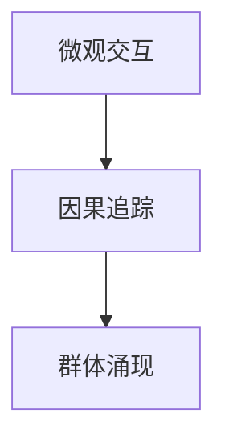

# AI 推荐日报系统

> 一个自动化的 AI 技术日报生成系统，每日采集、分析、整理 AI 领域的最新论文、文章和开源项目。

## 📋 项目概述

AI 推荐日报系统是一个全自动的内容采集与报告生成平台，主要功能包括：

- **自动采集**：每日自动采集 arXiv 论文、热门技术文章、GitHub 开源项目
- **智能分析**：使用 AI 生成论文深度解读、文章摘要、项目介绍
- **封面生成**：使用 Seedream AI 自动生成高质量封面图
- **报告生成**：生成美观的交互式 HTML 报告
- **历史归档**：自动归档历史数据，支持回溯查看

## 🗂️ 项目结构

```
ai_daily/
├── README.md                   # 项目文档
├── index.html                  # 当天日报主页
│
├── scripts/                    # 核心脚本
│   ├── collect_*.py           # 数据采集脚本
│   ├── generate_*.py          # 报告生成脚本
│   ├── batch_*.py             # 批量处理脚本
│   ├── translate_*.py         # 翻译脚本
│   ├── run_daily.py           # 每日主流程脚本
│   └── enhanced/              # 增强版处理模块
│       ├── batch_processor.py      # 批量论文处理器
│       ├── paper_extractor.py      # PDF 内容提取器
│       ├── insight_generator.py    # AI 解读生成器
│       └── generate_insight_page.py # HTML 页面生成器
│
├── daily_data/                 # 每日原始数据 (JSON)
│   └── YYYY-MM-DD.json
│
├── archive/                    # 历史归档
│   ├── YYYY-MM-DD/            # 按日期归档
│   │   ├── index.html
│   │   └── insights/
│   ├── archive.html           # 归档索引页
│   └── index.json             # 归档元数据
│
├── docs/                       # 部署目录
│   ├── index.html             # 主报告
│   ├── insights/              # 论文解读页面
│   └── covers/                # 封面图目录
│
├── covers/                     # 封面图存储
│   ├── paper_<arxiv_id>.jpg   # 论文封面
│   ├── pick_<index>.jpg       # 精选封面
│   ├── article_<index>.jpg    # 文章封面
│   └── github_<index>.jpg     # 项目封面
│
├── insights_enhanced/          # 增强版论文解读 (Markdown)
│   └── YYYY-MM-DD_<arxiv_id>.md
│
├── paper_cache/                # PDF 缓存目录
│   └── <arxiv_id>.pdf
│
├── conferences/                # 顶会论文数据
│   ├── RecSys_2025/
│   ├── KDD_2025/
│   ├── SIGIR_2025/
│   ├── WSDM_2025/
│   ├── WWW_2025/
│   └── CIKM_2025/
│
├── logs/                       # 日志文件
│   ├── batch_process.log
│   └── cover_generation.log
│
└── config/                     # 配置文件
```

## 🚀 快速开始

### 1. 环境准备

```bash
# 安装依赖
pip install requests beautifulsoup4 feedparser python-dateutil

# 可选：PDF 处理
pip install PyMuPDF pdf2image

# 配置 API 密钥
# 编辑 ~/.openclaw/.xiaoyienv
PERSONAL-API-KEY=your_api_key
PERSONAL-UID=your_uid
SERVICE_URL=https://celia-claw-drcn.ai.dbankcloud.cn
```

### 2. 每日运行

```bash
# 完整流程（采集 + 生成报告）
python3 scripts/run_daily.py

# 或分步执行：

# 1. 采集数据
python3 scripts/collect_daily.py

# 2. 生成报告
python3 scripts/generate_report.py --date 2026-04-20

# 3. 生成封面
python3 scripts/batch_generate_covers.py --date 2026-04-20

# 4. 部署
cp -r docs/* ~/public_html/ai-daily/
```

## 📊 数据流程

```
┌─────────────────────────────────────────────────────────────┐
│                      数据采集层                              │
├─────────────────────────────────────────────────────────────┤
│  arXiv API    微信公众号    GitHub Trending    技术博客      │
│     ↓            ↓              ↓               ↓           │
│  collect_arxiv  collect_wechat  collect_github  collect_articles │
└─────────────────────────────────────────────────────────────┘
                          ↓
┌─────────────────────────────────────────────────────────────┐
│                      数据处理层                              │
├─────────────────────────────────────────────────────────────┤
│  daily_data/YYYY-MM-DD.json                                 │
│     ↓                                                        │
│  select_daily_pick.py  →  每日精选                           │
│  translate_papers.py   →  中文翻译                           │
│  batch_processor.py    →  论文深度解读                        │
└─────────────────────────────────────────────────────────────┘
                          ↓
┌─────────────────────────────────────────────────────────────┐
│                      内容生成层                              │
├─────────────────────────────────────────────────────────────┤
│  batch_generate_covers.py  →  封面图生成                     │
│  generate_report.py        →  HTML 报告                      │
│  generate_insight_page.py  →  论文解读页面                   │
└─────────────────────────────────────────────────────────────┘
                          ↓
┌─────────────────────────────────────────────────────────────┐
│                      发布归档层                              │
├─────────────────────────────────────────────────────────────┤
│  docs/           →  部署目录                                 │
│  archive/        →  历史归档                                 │
│  push_report.py  →  推送通知                                 │
└─────────────────────────────────────────────────────────────┘
```

## 📝 核心脚本说明

### 数据采集脚本

| 脚本 | 功能 | 数据源 |
|------|------|--------|
| `collect_daily.py` | 每日综合采集 | arXiv + GitHub + 微信 |
| `collect_articles.py` | 技术文章采集 | InfoQ、机器之心等 |
| `collect_github.py` | GitHub 项目采集 | GitHub Trending |
| `collect_conferences.py` | 顶会论文采集 | RecSys、KDD、SIGIR 等 |
| `collect_wechat_rss.py` | 微信公众号采集 | RSSHub |

### 报告生成脚本

| 脚本 | 功能 | 输出 |
|------|------|------|
| `generate_report.py` | 主报告生成 | `index.html` |
| `generate_beautiful_report.py` | 美化版报告 | 带动画效果的报告 |
| `generate_paper_insights.py` | 论文解读生成 | Markdown 文件 |
| `batch_generate_covers.py` | 批量封面生成 | JPG 图片 |

### 增强版处理模块

| 模块 | 功能 | 特性 |
|------|------|------|
| `paper_extractor.py` | PDF 内容提取 | 章节结构、图表、公式、参考文献 |
| `insight_generator.py` | AI 解读生成 | 流程图、代码示例、LaTeX 公式 |
| `batch_processor.py` | 批量处理器 | 断点续传、进度跟踪 |
| `generate_insight_page.py` | HTML 页面生成 | 响应式设计、代码高亮 |

## 🎨 封面图生成

### 命名规则

```
arXiv 论文:    paper_<arxiv_id>.jpg     (例: paper_2604.15037.jpg)
每日精选:      pick_<index>.jpg         (例: pick_1.jpg)
热门文章:      article_<index>.jpg      (例: article_1.jpg)
GitHub 项目:   github_<index>.jpg       (例: github_1.jpg)
```

### 生成策略

1. **优先级顺序**：
   - 检查已有封面（> 10KB 视为有效）
   - 检查处理进度（跳过已处理）
   - AI 生成（Seedream）

2. **提示词模板**：
   - `paper`: 学术论文风格，蓝白配色
   - `article`: 科技新闻风格，渐变背景
   - `github`: GitHub 风格，深色主题
   - `pick`: 精选内容，优雅渐变

### 使用方法

```bash
# 为今天的数据生成封面
python3 scripts/batch_generate_covers.py

# 为指定日期生成封面（每类最多 10 条）
python3 scripts/batch_generate_covers.py --date 2026-04-20 --limit 10

# 后台运行
nohup python3 scripts/batch_generate_covers.py --date 2026-04-20 > logs/cover_generation.log 2>&1 &

# 查看进度
bash scripts/check_cover_progress.sh
```

## 📄 论文深度解读

### 功能特性

- **完整内容提取**：章节结构、图表说明、公式、参考文献
- **AI 深度解读**：背景动机、核心方法、实验结果、创新点
- **可视化增强**：Mermaid 流程图、LaTeX 公式渲染
- **代码示例**：Python 伪代码展示核心思想
- **工业应用**：落地场景、实现难度、挑战分析

### 使用方法

```bash
# 批量处理论文
python3 scripts/enhanced/batch_processor.py --limit 10

# 处理指定起始位置
python3 scripts/enhanced/batch_processor.py --start 5 --limit 10
```

### 输出示例

```markdown
# 智能体微观物理学：生成式AI安全的宣言

**将智能体交互的微观动态与群体风险进行因果关联，开创AI安全研究新范式**

> 📅 预计阅读：15分钟 | 难度：高级 | arXiv: [2604.15236](http://arxiv.org/abs/2604.15236)

### 📌 TL;DR
- **一句话总结**：提出Agentic Microphysics框架，从微观交互层面理解和控制AI群体的涌现风险。
- **核心贡献**：引入「Agentic Microphysics」概念，建立从智能体局部交互到群体动态的因果解释链路。

## 💡 核心方法
[详细内容...]

### 📊 方法流程图


### 💻 代码示例
```python
# 伪代码示例
def analyze_microphysics(agent_a, agent_b):
    interaction = agent_a.interact(agent_b)
    causal_chain = trace_causality(interaction)
    return causal_chain
```
```

## 🔧 配置说明

### API 配置

编辑 `~/.openclaw/.xiaoyienv`：

```bash
# 小艺 API 配置
PERSONAL-API-KEY=your_api_key
PERSONAL-UID=your_uid
SERVICE_URL=https://celia-claw-drcn.ai.dbankcloud.cn

# MiniMax API（可选）
MINIMAX_API_KEY=your_minimax_key
```

### 数据源配置

编辑 `config/sources.json`：

```json
{
  "arxiv": {
    "categories": ["cs.AI", "cs.LG", "cs.CL", "cs.IR"],
    "max_results": 50
  },
  "github": {
    "languages": ["Python", "JavaScript", "TypeScript"],
    "since": "daily"
  },
  "wechat": {
    "accounts": ["机器之心", "量子位", "InfoQ"],
    "rsshub_url": "http://localhost:1200"
  }
}
```

## 📊 数据格式

### daily_data/YYYY-MM-DD.json

```json
{
  "date": "2026-04-20",
  "daily_pick": [
    {
      "id": "unique_id",
      "title": "文章标题",
      "cn_title": "中文标题",
      "summary": "英文摘要",
      "cn_summary": "中文摘要",
      "link": "https://...",
      "source": "来源",
      "category": "分类",
      "cover_image": "covers/pick_1.jpg",
      "published": "2026-04-20"
    }
  ],
  "arxiv_papers": [...],
  "github_projects": [...],
  "hot_articles": [...]
}
```

## 🌐 部署说明

### 静态部署

```bash
# 复制到 Web 目录
cp -r docs/* ~/public_html/ai-daily/
cp -r covers ~/public_html/ai-daily/

# 或使用 rsync
rsync -av --delete docs/ covers/ ~/public_html/ai-daily/
```

### Nginx 配置

```nginx
server {
    listen 80;
    server_name ai-daily.example.com;
    root /var/www/ai-daily;

    location / {
        index index.html;
        try_files $uri $uri/ =404;
    }

    location /covers/ {
        expires 30d;
        add_header Cache-Control "public, immutable";
    }
}
```

## 📈 性能优化

### 封面生成优化

- 使用后台任务避免阻塞
- 支持断点续传
- 自动跳过已有封面
- API 调用间隔控制

### 报告生成优化

- 按需加载论文解读页面
- 图片懒加载
- CSS/JS 压缩
- CDN 加速

## 🔍 监控与日志

### 日志文件

- `logs/batch_process.log` - 批量处理日志
- `logs/cover_generation.log` - 封面生成日志
- `logs/cover_generation_progress.json` - 封面生成进度

### 监控脚本

```bash
# 查看封面生成进度
bash scripts/check_cover_progress.sh

# 查看批量处理状态
tail -f logs/batch_process.log
```

## 🐛 故障排查

### 常见问题

1. **封面生成失败**
   - 检查 Seedream API 配置
   - 检查网络连接
   - 查看日志文件

2. **PDF 提取失败**
   - 安装 PyMuPDF: `pip install PyMuPDF`
   - 检查 PDF 文件是否损坏

3. **报告生成异常**
   - 检查数据文件格式
   - 检查模板文件是否存在

## 📚 依赖说明

### 必需依赖

```
requests>=2.28.0
beautifulsoup4>=4.11.0
feedparser>=6.0.0
python-dateutil>=2.8.0
```

### 可选依赖

```
PyMuPDF>=1.22.0      # PDF 处理
pdf2image>=1.16.0    # PDF 转图片
Pillow>=9.0.0        # 图片处理
```

## 📄 许可证

MIT License

## 👥 贡献者

- AI 推荐日报团队

## 📞 联系方式

- 项目地址：https://github.com/your-org/ai-daily
- 问题反馈：https://github.com/your-org/ai-daily/issues
