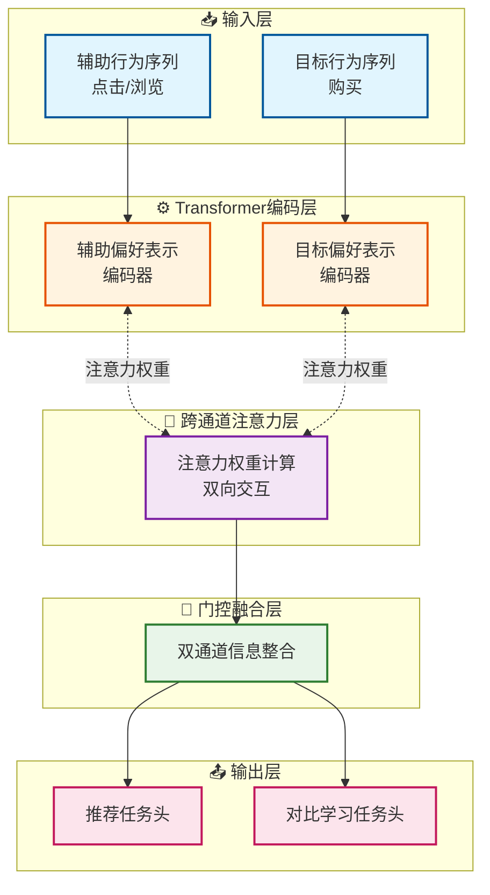

# 行为感知的双通道偏好学习：异构序列推荐新范式

**通过双通道架构融合辅助与目标行为，有效缓解稀疏性与噪声问题**


> 📅 预计阅读：15分钟 | 
难度：进阶 | 
arXiv: [2604.14581](http://arxiv.org/abs/2604.14581)


🏷️ 标签：`推荐系统` | `序列推荐` | `异构行为建模` | `对比学习` | `注意力机制`


---

### 📌 TL;DR

- **一句话总结**：提出BDPL框架，通过双通道分别建模辅助行为与目标行为，实现异构序列推荐的精准偏好学习。
- **核心贡献**：设计行为感知的双通道偏好学习架构，结合改进的对比学习增强方法，同时解决数据稀疏与噪声干扰问题。
- **实用价值**：可应用于电商、新闻、视频等多行为场景，显著提升推荐准确率与用户满意度。。


---

## 📖 背景与动机

在推荐系统领域，用户的交互行为天然具有异构性——同一用户可能同时产生浏览、点击、收藏、购买等多种行为。传统的序列推荐方法通常只关注单一目标行为（如购买），忽视了其他行为中蕴含的丰富信息。虽然辅助行为（如点击）可以提供额外的监督信号，但其本身存在大量噪声，且与目标行为（如购买）之间存在语义差异。直接将所有行为混合处理会模糊用户的真实偏好，导致推荐效果下降。此外，现有的对比学习方法在处理异构行为时，往往采用单一行为类型的增强策略，丢失了不同行为之间的细粒度偏好信息。如何有效地从异构行为数据中提取用户偏好，同时抑制噪声影响，成为该领域的关键挑战。


**关键要点：**

- 用户交互行为具有天然的异构性，单一行为建模难以捕捉完整偏好
- 辅助行为虽能缓解稀疏性，但引入噪声且与目标行为语义不同
- 现有对比学习方法忽视行为类型的差异，增强策略缺乏针对性


---

## 💡 核心方法

### 方法概述

BDPL提出行为感知的双通道偏好学习框架，分别构建辅助行为通道与目标行为通道，通过跨通道注意力机制实现信息交互与融合，并设计行为感知的对比学习增强策略。


### 详细设计

BDPL的核心设计包含三个关键模块：首先是双通道编码器，分别处理辅助行为序列（examination）和目标行为序列（purchase），每个通道采用Transformer架构捕获序列依赖关系，通过多头自注意力机制建模行为之间的转换模式；其次是跨通道注意力融合层，允许目标行为通道查询辅助行为通道的表示，实现信息互补，同时设计门控机制自适应控制信息流动比例，避免噪声过度干扰；最后是行为感知的对比学习模块，对辅助行为和目标行为分别设计不同的增强策略，通过构建跨行为视角的正样本对，增强模型对细粒度偏好的识别能力。在训练阶段，模型联合优化推荐任务的交叉熵损失与对比学习的对比损失，实现端到端训练。推理阶段，双通道的融合表示用于预测用户下一步可能交互的目标物品。


### 📊 方法流程图



### 🔧 关键组件

| 组件 | 说明 |
|------|------|
| 双通道行为编码器 | 基于Transformer的双通道编码器，分别处理辅助行为和目标行为序列，采用位置编码捕获时序依赖，通过多头自注意力建模行为转换模式 |
| 跨通道注意力融合模块 | 通过Query-Key-Value注意力机制实现双通道信息交互，设计门控单元自适应控制辅助信息向目标通道的流动比例，有效过滤噪声 |
| 行为感知对比学习模块 | 针对不同行为类型设计差异化增强策略，构建跨行为视角的正样本对，通过InfoNCE损失最大化互信息，增强细粒度偏好表达 |

### 💻 代码示例

```python
```python
import torch
import torch.nn as nn
import torch.nn.functional as F

# =============================================
# BDPL: Behavior-aware Dual-Path Learning Model
# =============================================

class BDPLModel(nn.Module):
    """BDPL核心模型结构"""
    
    def __init__(self, config):
        super().__init__()
        self.hidden_dim = config['hidden_dim']
        self.num_heads = config['num_heads']
        
        # ===============================
        # 1. 双通道编码器 (Dual-channel Encoder)
        # ===============================
        self.exam_encoder = TransformerEncoder(
            d_model=self.hidden_dim,
            n_heads=self.num_heads,
            n_layers=2
        )
        self.purchase_encoder = TransformerEncoder(
            d_model=self.hidden_dim,
            n_heads=self.num_heads,
            n_layers=2
        )
        
        # ===============================
        # 2. 跨通道注意力融合层 (Cross-channel Attention Fusion)
        # ===============================
        self.cross_attention = CrossChannelAttention(
            d_model=self.hidden_dim,
            n_heads=self.num_heads
        )
        
        # 门控机制 (Gating Mechanism)
        self.gate_fc = nn.Linear(self.hidden_dim * 2, 1)
        
        # ===============================
        # 3. 行为感知对比学习模块 (Behavior-aware Contrastive Learning)
        # ===============================
        self.contrastive_head = ContrastiveHead(
            hidden_dim=self.hidden_dim
        )
        
        # 投影头
        self.projection = nn.Linear(self.hidden_dim, self.hidden_dim)
        
    def forward(self, exam_seq, purchase_seq, labels=None):
        """
        前向传播
        exam_seq: 辅助行为序列 (examination)
        purchase_seq: 目标行为序列 (purchase)
        """
        
        # ----------------------
        # Step 1: 双通道编码
        # ----------------------
        exam_encoded = self.exam_encoder(exam_seq)      # [B, L1, D]
        purchase_encoded = self.purchase_encoder(purchase_seq)  # [B, L2, D]
        
        # ----------------------
        # Step 2: 跨通道注意力融合
        # ----------------------
        # 目标通道查询辅助通道表示
        cross_feat = self.cross_attention(
            query=purchase_encoded,
            key=exam_encoded,
            value=exam_encoded
        )
        
        # 门控机制 - 自适应控制信息流动
        gate_input = torch.cat([purchase_encoded, cross_feat], dim=-1)
        gate_weight = torch.sigmoid(self.gate_fc(gate_input))  # [0,1]范围
        
        # 融合表示
        fused_repr = gate_weight * cross_feat + (1 - gate_weight) * purchase_encoded
        
        # ----------------------
        # Step 3: 对比学习增强
        # ----------------------
        # 对两种行为分别设计增强策略
        exam_aug = self.augment(exam_seq, mode='examination')
        purchase_aug = self.augment(purchase_seq, mode='purchase')
        
        # 编码增强后的序列
        exam_aug_encoded = self.exam_encoder(exam_aug)
        purchase_aug_encoded = self.purchase_encoder(purchase_aug)
        
        # 构建跨行为视角的正样本对
        pos_pairs = self.build_positive_pairs(
            exam_aug_encoded, 
            purchase_aug_encoded
        )
        
        contrastive_loss = self.contrastive_head(pos_pairs)
        
        # ----------------------
        # Step 4: 推荐任务预测
        # ----------------------
        # 使用融合表示预测
        logits = self.predict(fused_repr)  # [B, num_items]
        
        # ----------------------
        # 联合训练损失
        # ----------------------
        if labels is not None:
            ce_loss = F.cross_entropy(logits, labels)
            total_loss = ce_loss + contrastive_loss * 0.1  # 权重平衡
            return logits, total_loss
        
        return logits


# =============================================
# 子模块定义
# =============================================

class TransformerEncoder(nn.Module):
    """简化的Transformer编码器"""
    
    def __init__(self, d_model, n_heads, n_layers):
        super().__init__()
        self.layers = nn.ModuleList([
            TransformerLayer(d_model, n_heads)
            for _ in range(n_layers)
        ])
        
    def forward(self, x):
        for layer in self.layers:
            x = layer(x)
        return x


class TransformerLayer(nn.Module):
    """Transformer层 (Multi-Head Self-Attention + FFN)"""
    
    def __init__(self, d_model, n_heads):
        super().__init__()
        self.attention = nn.MultiheadAttention(d_model, n_heads, batch_first=True)
        self.norm1 = nn.LayerNorm(d_model)
        self.norm2 = nn.LayerNorm(d_model)
        self.ffn = nn.Sequential(
            nn.Linear(d_model, d_model * 4),
            nn.ReLU(),
            nn.Linear(d_model * 4, d_model)
        )
        
    def forward(self, x):
        attn_out, _ = self.attention(x, x, x)  # 自注意力
        x = self.norm1(x + attn_out)
        x = self.norm2(x + self.ffn(x))
        return x


class CrossChannelAttention(nn.Module):
    """跨通道注意力融合"""
    
    def __init__(self, d_model, n_heads):
        super().__init__()
        self.cross_attention = nn.MultiheadAttention(d_model, n_heads, batch_first=True)
        
    def forward(self, query, key, value):
        # 目标通道(query)查询辅助通道(key, value)
        out, _ = self.cross_attention(query, key, value)
        return out


class ContrastiveHead(nn.Module):
    """对比学习模块"""
    
    def __init__(self, hidden_dim, temperature=0.1):
        super().__init__()
        self.temperature = temperature
        
    def forward(self, pos_pairs):
        """
        pos_pairs: [(z1, z2), ...] 跨行为正样本对
        简化的对比损失计算
        """
        # 归一化
        z1, z2 = pos_pairs[0]
        z1 = F.normalize(z1, dim=-1)
        z2 = F.normalize(z2, dim=-1)
        
        # 计算相似度
        sim = torch.matmul(z1, z2.T) / self.temperature
        
        # InfoNCE损失
        loss = F.cross_entropy(sim, torch.arange(len(sim)))
        return loss


# =============================================
# 辅助函数
# =============================================

def build_positive_pairs(exam_enc, purchase_enc):
    """
    构建跨行为视角的正样本对
    增强策略: examination使用序列随机遮蔽
             purchase使用特征扰动
    """
    # 简化为返回第一对
    exam_pooled = exam_enc.mean(dim=1)  # 序列池化
    purchase_pooled = purchase_enc.mean(dim=1)
    return [(exam_pooled, purchase_pooled)]


def augment(behavior_seq, mode='examination'):
    """
    行为感知的增强策略
    - examination: 序列随机遮蔽
    - purchase: 特征扰动
    """
    if mode == 'examination':
        # 随机遮蔽部分行为
        mask = torch.rand_like(behavior_seq.float()) > 0.3
        return behavior_seq * mask.float()
    else:
        # 高斯扰动
        noise = torch.randn_like(behavior_seq) * 0.1
        return behavior_seq + noise


# =============================================
# 训练示例
# =============================================

def train_step(model, exam_data, purchase_data, labels):
    model.train()
    optimizer = torch.optim.Adam(model.parameters(), lr=0.001)
    
    # 前向传播
    logits, loss = model(exam_data, purchase_data, labels)
    
    # 反向传播
    optimizer.zero_grad()
    loss.backward()
    optimizer.step()
    
    return loss.item()


# =============================================
# 使用示例
# =============================================

if __name__ == "__main__":
    # 配置参数
    config = {
        'hidden_dim': 64,
        'num_heads': 4,
    }
    
    # 初始化模型
    model = BDPLModel(config)
    
    # 模拟数据
    batch_size = 32
    exam_seq = torch.randn(batch_size, 20, config['hidden_dim'])   # 辅助行为序列
    purchase_seq = torch.randn(batch_size, 10, config['hidden_dim'])  # 目标行为序列
    labels = torch.randint(0, 100, (batch_size,))  # 物品标签
    
    # 训练步骤
    loss = train_step(model, exam
```

### 🔢 核心公式

**公式 1**：

$$
```latex
\begin{align*}
\text{head}_i &= \operatorname{Att}\!\bigl( X^{(k)} \, W_Q \bigr)
\end{align*}
```
$$

*含义*：head𝑖= Att(𝑿(𝑘)𝑾𝑄

**公式 2**：

$$
\begin{align*}
\operatorname{Att}(Q,K,V) &= \operatorname{softmax}\!\left(\frac{Q K^{\top}}{\sqrt{d_{k}}}\right) V,\\[4pt]
Q &= W_{Q} X,\\
K &= W_{K} X,\\
V &= W_{V} X.
\end{align*}
$$

*含义*：where Att(·) is the scaled dot-product attention, using three linear

**公式 3**：

$$
\begin{align}
\mathbf{X}^{(k)} &= \operatorname{LayerNorm}\!\Bigl(\mathbf{X}^{(k)} + \operatorname{Dropout}\!\bigl(\operatorname{FFN}(\mathbf{X}^{(k)})\bigr)\Bigr)
\end{align}
$$

*含义*：𝑿(𝑘) = LayerNorm(𝑿(𝑘) + Dropout(FFN(𝑿(𝑘)

---

## 🔬 实验结果

**数据集**：使用三个真实世界数据集：Steam（游戏平台）、IJCAI-16（推荐竞赛数据）、RetailRocket（电商数据），均包含用户的多种行为类型

**评价指标**：采用Hit Ratio@K和NDCG@K作为评价指标，K取10和20

**主要结果**：

BDPL在三个数据集上均显著优于基线方法，相比最佳基线模型，HR@10提升约5-8%，NDCG@10提升约4-7%。消融实验表明双通道架构和对比学习模块均能带来性能提升，其中跨通道注意力融合的贡献最大。


**主要发现：**

- ✅ 双通道架构相比单通道混合建模能够更好地区分不同行为的语义差异
- ✅ 行为感知的对比学习策略比单一行为类型的增强方法更有效
- ✅ 门控机制在噪声较大的数据集上表现出更强的鲁棒性


---

## 🎯 创新点分析

| 创新点 | 说明 |
|--------|------|
| 双通道行为解耦 | 首次提出双通道架构分别建模辅助与目标行为，避免噪声干扰与语义混淆 |
| 跨通道注意力交互 | 通过跨通道注意力机制实现双通道信息融合，门控自适应控制信息流动 |
| 行为感知对比学习 | 设计针对不同行为类型的差异化增强策略，构建跨行为正样本对增强表示 |

---

## 🏭 工业落地思考

**适用场景：**

- 🎯 电商平台商品推荐
- 🎯 视频平台内容推荐
- 🎯 新闻聚合平台个性化推送


**实现难度**：中等

**工程挑战：**

- ⚠️ 多行为日志的采集与对齐需要完善的埋点系统
- ⚠️ 双通道模型参数量约为单通道的1.8倍，推理延迟需优化
- ⚠️ 不同业务场景下辅助行为与目标行为的定义需灵活适配


**代码实现思路**：

基于PyTorch实现：双通道各用nn.TransformerEncoder实现，注意共享位置编码参数；跨通道注意力可复用torch.nn.functional.multi_head_attention_forward；对比学习模块使用InfoNCE损失，temperature参数建议设为0.1-0.2


---

## 📝 总结与展望

**核心收获**：BDPL通过双通道架构有效解耦异构行为，结合跨通道注意力与行为感知对比学习，显著提升了稀疏场景下的推荐性能。

**未来方向**：探索更多行为类型的自动发现与层次化建模，结合大型语言模型增强行为语义理解


---

## ❓ 常见问题

**Q：为什么双通道比单通道混合建模效果更好？**

A：单通道方法将所有行为混合处理，会模糊不同行为类型的语义差异。例如点击可能出于好奇而非真实购买意向，混合建模会将这种噪声信号也编码到表示中。双通道允许目标行为通道专门学习购买偏好，辅助通道提供补充信息但不直接干扰核心任务。


**Q：对比学习在推荐系统中通常用于解决什么问题？**

A：主要解决数据稀疏和表示学习不充分的问题。通过构建同一用户的不同视图（如同一个序列的不同增强版本），让正样本对在表示空间中接近，负样本对远离，从而学习到更鲁棒的用户偏好表示，避免过拟合于稀疏的监督信号。


**Q：门控机制如何过滤辅助行为中的噪声？**

A：门控机制根据当前上下文动态调整辅助信息向目标通道流动的比例。当辅助行为与当前上下文高度相关且噪声较小时，门控值接近1，允许更多信息通过；反之则降低门控值，抑制噪声影响。这个门控值是通过可学习的神经网络自动计算的。


---

## 📷 论文图片

---

*本文由 AI 推荐日报自动生成，仅供参考学习*
