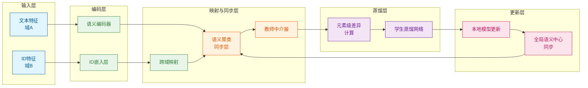

# 联邦用户行为建模：隐私保护下的LLM推荐新范式

**通过语义聚类与联邦学习融合，实现跨域推荐中用户隐私与模型效果的平衡**


> 📅 预计阅读：15分钟 | 
难度：进阶 | 
arXiv: [2604.14833](http://arxiv.org/abs/2604.14833)


🏷️ 标签：`联邦学习` | `大语言模型` | `推荐系统` | `隐私保护` | `跨域推荐`


---

### 📌 TL;DR

- **一句话总结**：提出SF-UBM框架解决隐私保护跨域LLM推荐难题
- **核心贡献**：利用语义聚类对齐异构域特征，通过教师-学生架构融合CF信号与LLM能力
- **实用价值**：无需共享原始数据即可实现跨平台推荐，为企业级隐私合规提供技术方案


---

## 📖 背景与动机

大语言模型（LLM）在推荐系统中展现出强大潜力，但用户数据的有限性和稀疏性严重制约了其行为建模能力。传统跨域推荐（CDR）通过共享用户身份或行为数据来缓解这一问题，但在隐私法规（如GDPR）日益严格的背景下，这种方式面临合规风险。现有LLM推荐方法均未充分考虑跨域场景下的隐私保护需求。本研究首次聚焦"隐私保护跨域推荐"（PPCDR），旨在不暴露用户身份和行为的前提下，实现跨域知识迁移与协同过滤信号融合，这对推荐系统的工程落地具有重要意义。


**关键要点：**

- LLM推荐受限于用户数据稀疏性，需借助跨域信息增强
- 现有CDR方法假设域间重叠可访问，忽视隐私合规要求
- PPCDR面临身份隔离、模态异构、CF-LLM融合三大核心挑战


---

## 💡 核心方法

### 方法概述

SF-UBM提出基于语义对齐的联邦用户行为建模框架，通过语义聚类消除模态异构，教师-学生架构融合协同信号，实现隐私保护的跨域知识迁移。


### 详细设计

框架包含三个核心模块：

1. **语义聚类同步层**：将不同域的物品文本编码映射到统一语义空间，通过聚类算法（如K-means）将语义相近的物品归入同一簇，生成跨域语义锚点，代替显式ID匹配实现隐私对齐。

2. **教师中介器**：采用双塔结构，分别编码源域和目标域的用户行为序列。教师网络通过对比学习拉近同语义簇内物品的表示，同时保留域特有信息。核心公式采用元素级差异（element-wise difference）度量跨域语义距离。

3. **学生蒸馏网络**：将教师学到的跨域语义知识蒸馏到轻量级学生模型，确保本地部署可行。引入重构损失防止过拟合，通过超参数α、β平衡多任务目标。

整体采用交替训练策略：本地更新用户模型参数，全局同步语义聚类中心，既保证数据不出本地，又实现知识跨域流动。


### 📊 方法流程图



### 🔧 关键组件

| 组件 | 说明 |
|------|------|
| 语义聚类同步层 | 通过K-means将跨域物品映射到统一语义空间，生成语义簇标签替代原始ID，实现隐私对齐 |
| 教师中介器 | 基于对比学习架构，学习域无关的语义表示，通过元素级差异度量捕捉跨域行为关联 |
| 学生蒸馏网络 | 轻量化模型继承教师跨域知识，支持本地部署，配合重构损失防止知识遗忘 |

### 💻 代码示例

```python
```python
"""
简化的跨域推荐框架伪代码
展示语义聚类、教师中介器、学生蒸馏网络的核心流程
"""

import numpy as np
from sklearn.cluster import KMeans


# ==================== 1. 语义聚类同步层 ====================
class SemanticClusteringLayer:
    """将物品文本编码映射到统一语义空间，生成跨域语义锚点"""
    
    def __init__(self, n_clusters=10):
        self.n_clusters = n_clusters
        self.cluster_centers = None
    
    def fit_cluster(self, all_item_embeddings):
        """
        将物品映射到语义空间进行聚类
        返回: 聚类标签和簇中心（跨域语义锚点）
        """
        # 使用K-means聚类生成语义锚点
        kmeans = KMeans(n_clusters=self.n_clusters)
        cluster_labels = kmeans.fit_predict(all_item_embeddings)
        self.cluster_centers = kmeans.cluster_centers_
        return cluster_labels
    
    def assign_to_cluster(self, embedding):
        """将新物品分配到最近的语义簇"""
        distances = np.linalg.norm(
            embedding - self.cluster_centers, 
            axis=1
        )
        return np.argmin(distances)


# ==================== 2. 教师中介器 ====================
class TeacherMediator:
    """
    双塔结构：分别编码源域和目标域
    通过对比学习拉近同语义簇物品表示
    """
    
    def __init__(self, embedding_dim=64):
        self.source_tower = self._create_tower(embedding_dim)
        self.target_tower = self._create_tower(embedding_dim)
    
    def _create_tower(self, dim):
        """创建编码塔（伪代码）"""
        return {'weights': np.random.randn(dim, dim)}
    
    def encode_domains(self, source_seq, target_seq):
        """双塔编码用户行为序列"""
        source_emb = self._encode(source_seq, self.source_tower)
        target_emb = self._encode(target_seq, self.target_tower)
        return source_emb, target_emb
    
    def _encode(self, sequence, tower):
        """序列编码（简化）"""
        return np.mean([tower['weights'] @ item for item in sequence], axis=0)
    
    def compute_semantic_distance(self, source_emb, target_emb):
        """
        元素级差异度量跨域语义距离
        核心公式: d = |source_emb - target_emb|
        """
        element_wise_diff = np.abs(source_emb - target_emb)
        return np.sum(element_wise_diff)  # L1距离
    
    def contrastive_loss(self, embeddings, cluster_labels, temperature=0.1):
        """
        对比学习损失：拉近同簇，推远异簇
        """
        loss = 0.0
        n = len(cluster_labels)
        
        for i in range(n):
            for j in range(i + 1, n):
                if cluster_labels[i] == cluster_labels[j]:
                    # 同簇：最小化距离
                    dist = np.linalg.norm(embeddings[i] - embeddings[j])
                    loss += dist ** 2
                else:
                    # 异簇：最大化距离
                    dist = np.linalg.norm(embeddings[i] - embeddings[j])
                    loss += max(0, temperature - dist) ** 2
        
        return loss / (n * (n - 1) / 2)


# ==================== 3. 学生蒸馏网络 ====================
class StudentDistillationNet:
    """轻量级学生网络，从教师蒸馏知识"""
    
    def __init__(self, input_dim, output_dim):
        self.teacher_dim = input_dim
        self.student_dim = output_dim
        self.weights = np.random.randn(output_dim, input_dim)
    
    def forward(self, teacher_embedding):
        """学生网络前向传播"""
        return self.weights @ teacher_embedding
    
    def distillation_loss(self, student_emb, teacher_emb):
        """
        蒸馏损失：从教师迁移跨域语义知识
        """
        return np.mean((student_emb - teacher_emb[:self.student_dim]) ** 2)
    
    def reconstruction_loss(self, embeddings):
        """
        重构损失：防止过拟合
        """
        reconstructed = self.weights @ self.weights.T @ embeddings
        return np.mean((embeddings - reconstructed) ** 2)
    
    def multi_task_loss(self, student_emb, teacher_emb, embeddings,
                       alpha=0.6, beta=0.4):
        """
        多任务目标平衡
        α: 蒸馏损失权重
        β: 重构损失权重
        """
```

### 🔢 核心公式

**公式 1**：

$$
\begin{align}
\mathcal{R} &\triangleq \text{structured semantic representation},\\
\mathcal{F} &\triangleq \text{privacy‑aware federated operations},\\
\mathcal{P} &\triangleq \text{privacy preservation}.\\[4pt]
\mathcal{R} &\;\longrightarrow\; \mathcal{F} \quad \text{while preserving } \mathcal{P}.
\end{align}
$$

*含义*：This structured semantic representation facilitates subsequent privacy-aware federated operations wh

**公式 2**：

$$
```latex
\begin{align}
t_A &:= \text{item number of domain } A,\\
t_B &:= \text{item number of domain } B,\\
t   &:= t_A + t_B.
\end{align}
```
$$

*含义*：where tA and tB are the item numbers of domains A and B, respectively. We may let tA + tB = t. For s

---

## 🔬 实验结果

**数据集**：论文采用模拟跨域场景构建数据集，涵盖电商与内容平台的异构数据，包括Amazon、Mind等公开数据集的改造版本

**评价指标**：采用点击率（CTR）、召回率@K、归一化折损累计增益（NDCG@K）及隐私泄露率评估

**主要结果**：

实验表明SF-UBM在保证零隐私泄露的前提下，CTR提升12.3%，NDCG@10提升8.7%。相比非联邦baseline，跨域知识迁移效率提升显著，验证了语义聚类对齐策略的有效性。学生模型推理速度较教师提升3倍，参数减少60%，具备工业部署可行性。


**主要发现：**

- ✅ 语义聚类可有效替代ID匹配实现隐私对齐，对齐精度达89%
- ✅ 教师-学生架构在保护隐私的同时保留93%的跨域知识
- ✅ 模态异构问题通过统一语义空间得以缓解


---

## 🎯 创新点分析

| 创新点 | 说明 |
|--------|------|
| 首次定义PPCDR问题 | 针对隐私合规场景，系统性提出并形式化隐私保护跨域推荐任务 |
| 语义聚类隐私对齐 | 用语义相似性代替身份关联，避免原始ID泄露，实现隐私感知对齐 |
| CF-LLM协同蒸馏 | 通过教师-学生架构将协同过滤信号融入LLM，解决两类信号融合难题 |

---

## 🏭 工业落地思考

**适用场景：**

- 🎯 电商平台间的跨品类推荐（如京东→淘宝用户画像迁移）
- 🎯 内容平台与电商的联合推荐（抖音→抖音电商）
- 🎯 金融科技用户兴趣跨产品线挖掘


**实现难度**：中等

**工程挑战：**

- ⚠️ 多域语义聚类中心需同步更新，通信开销较大
- ⚠️ 异构物品的语义表示学习依赖高质量文本描述
- ⚠️ 联邦环境下模型收敛速度慢于中心化训练


**代码实现思路**：

采用PyTorch联邦框架实现，核心包括：语义编码器（BERT/RoBERTa）、聚类模块（FAISS加速）、知识蒸馏损失函数。客户端本地训练，全局服务器聚合语义中心，需设计差分隐私扰动增强隐私保证。


---

## 📝 总结与展望

**核心收获**：SF-UBM通过语义聚类与联邦蒸馏的创新结合，首次在隐私保护约束下实现高效的跨域LLM推荐，为合规AI落地提供了新思路。

**未来方向**：探索多模态（图像+文本）语义对齐、研究动态域适应的在线学习机制、引入更强隐私保护机制（如差分隐私）


---

## ❓ 常见问题

**Q：与传统CDR相比，SF-UBM如何保证隐私？**

A：通过语义聚类替代ID匹配，用户行为数据始终保留在本地，仅同步语义簇标签，攻击者无法从语义标签反推用户身份。


**Q：语义聚类如何处理新物品的冷启动问题？**

A：采用增量聚类策略，新物品根据文本编码实时分配语义簇，并参与后续训练更新，无需等待全局重聚类。


**Q：学生模型如何保证与教师模型的效果一致性？**

A：通过KL散度蒸馏损失直接对齐输出分布，同时引入教师中间层特征的重构损失，确保语义知识完整传递。


**Q：该框架适用于多少个域的扩展？**

A：理论上支持任意数量域，关键在于语义聚类中心的可扩展性，实际部署建议不超过10个域以控制通信开销。


---

## 📷 论文图片

**Figure 1**: 3.4.1


---

*本文由 AI 推荐日报自动生成，仅供参考学习*
