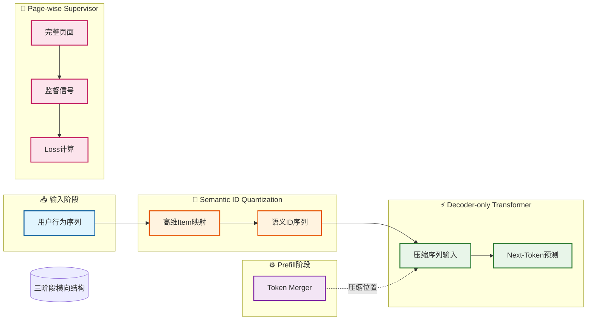

# GenRec：面向大规模推荐的生成式框架

**通过页面级监督和Token合并机制，实现工业级生成式推荐的端到端优化**


> 📅 预计阅读：15分钟 | 
难度：进阶 | 
arXiv: [2604.14878](http://arxiv.org/abs/2604.14878)


🏷️ 标签：`生成式推荐` | `工业落地` | `语义ID` | `用户偏好建模` | `JD.com`


---

### 📌 TL;DR

- **一句话总结**：GenRec提出页面级NTP任务和Token合并机制，解决生成式推荐的工业落地难题
- **核心贡献**：提出Page-wise NTP训练目标，将整个页面作为监督单元，解决逐点训练的一对多歧义问题；同时设计非对称线性Token Merger降低推理成本
- **实用价值**：已在京东App部署验证，在保证推荐质量的同时显著降低计算开销，为工业级生成式推荐提供可行方案


---

## 📖 背景与动机

生成式检索（Generative Retrieval, GR）通过next-token prediction（NTP）范式为推荐系统带来新思路。传统方法将用户历史交互序列作为输入，直接生成目标item ID，实现端到端的学习。然而，当GR扩展到京东这样的亿级用户、日活千万的工业场景时，面临严峻挑战：首先是pagination问题——同一用户请求在翻页时输入完全相同但输出需不同，传统逐条监督的方式会产生歧义；其次是语义ID的多token表示导致长序列编码成本高昂；最后是如何让生成策略精确对齐用户偏好信号。GenRec正是为解决这三大挑战而生的工业级方案。


**关键要点：**

- 生成式推荐通过NTP范式实现端到端建模，理论上可捕获更复杂的用户-item交互模式
- 工业场景中pagination机制要求同一输入对应多个合理输出，传统的point-wise训练存在天然缺陷
- 语义ID的多token表示虽然增强了语义表达能力，但带来了序列长度膨胀的算力挑战


---

## 💡 核心方法

### 方法概述

GenRec是部署在京东App的端到端生成式推荐框架，采用decoder-only架构，通过语义ID量化高维item，并针对性设计了Page-wise NTP训练目标和Token Merger预填充优化。


### 详细设计

框架核心包含三大技术突破。第一，Page-wise NTP训练任务：不同于传统NTP只监督单个交互item，Page-wise NTP将整个交互页面作为监督单元。该设计提供更密集的梯度信号，让模型学习页面内item的共现关系，同时天然消除了pagination场景下的一对多歧义——同一输入序列可以对应同一个页面的多个item作为正样本。第二，非对称线性Token Merger：针对语义ID多token导致的预填充开销问题，论文提出非对称的token合并策略，在预填充阶段将连续多个token压缩为少数几个表示，大幅降低KV cache计算量。第三，偏好对齐机制：通过引入advantage-based的加权策略，将细粒度的用户偏好信号融入生成式策略训练，使模型更关注用户真正感兴趣的高价值item。


### 📊 方法流程图



### 🔧 关键组件

| 组件 | 说明 |
|------|------|
| Semantic ID Quantization | 将高维商品特征通过量化方法映射为连续的语义ID序列，保留item间的语义相似性，同时支持多token表示以增强表达能力 |
| Page-wise NTP Supervisor | 页面级监督模块，将交互页面整体作为监督信号，计算页面级别的loss，提供比单item监督更丰富的梯度信息 |
| Asymmetric Token Merger | 非对称线性压缩模块，在预填充阶段将连续的多token表示压缩为紧凑形式，降低KV cache计算复杂度 |
| Preference Aligned Training | 基于advantage的偏好对齐训练，根据item的用户偏好强度加权优化目标，使模型更关注高偏好item |

### 💻 代码示例

```python
import torch
import torch.nn as nn

# ============================================================
# 简化示例：展示论文三大技术突破的核心思想
# ============================================================

class PageWiseNTP(nn.Module):
    """第一突破：Page-wise NTP训练任务"""
    
    def forward(self, input_seq, page_items, page_labels):
        """
        input_seq: 用户交互序列
        page_items: 整个页面的item集合
        page_labels: 页面级别的正样本标签
        """
        # 传统NTP：只监督单个item
        # traditional_loss = self.ntp_loss(logits, single_item)  
        
        # Page-wise NTP：监督整个页面作为正样本集合
        # 一个输入序列可以对应页面内多个item作为正样本
        page_probs = self.get_page_probability(input_seq, page_items)
        
        # 密集梯度信号 + 消除一对多歧义
        loss = self.page_wise_loss(page_probs, page_labels)
        
        return loss


class AsymmetricTokenMerger(nn.Module):
    """第二突破：非对称线性Token Merger"""
    
    def __init__(self, token_dim, merge_ratio=4):
        super().__init__()
        # 预填充阶段：压缩多个token为少数表示
        self.prefill_merger = nn.Linear(token_dim * merge_ratio, token_dim)
        # 解码阶段：保持原始粒度
        self.decode_merger = nn.Identity()
        
    def compress_kv_cache(self, kv_cache):
        """
        预填充阶段：压缩连续token，大幅降低KV cache计算量
        """
        # 将 merge_ratio 个token合并为1个
        batch_size, seq_len, hidden = kv_cache.shape
        compressed_len = seq_len // self.merge_ratio
        
        # reshape + linear merge
        reshaped = kv_cache[:, :compressed_len * self.merge_ratio, :]
        reshaped = reshaped.view(-1, self.merge_ratio, hidden)
        compressed = self.prefill_merger(reshaped)
        
        return compressed


class PreferenceAlignment(nn.Module):
    """第三突破：偏好对齐机制（Advantage-based加权）"""
    
    def forward(self, policy_logits, items, user_preferences, advantages):
        """
        policy_logits: 模型输出的logits
        items: 候选item
        user_preferences: 用户偏好信号
        advantages: 计算得到的advantage值
        """
        # 计算原始策略概率
        probs = torch.softmax(policy_logits, dim=-1)
        
        # Advantage-based加权：关注高价值item
        # 高advantage的item获得更大权重
        weights = torch.exp(advantages)  # 指数加权，放大差异
        
        # 融入细粒度偏好信号
        preference_weighted_probs = probs * weights * user_preferences
        
        # 归一化
        aligned_probs = preference_weighted_probs / preference_weighted_probs.sum(dim=-1, keepdim=True)
        
        return aligned_probs


# ============================================================
# 整合框架示例
# ============================================================

class SimplifiedFramework(nn.Module):
    """简化的推荐框架"""
    
    def __init__(self):
        super().__init__()
        self.page_ntp = PageWiseNTP()
        self.token_merger = AsymmetricTokenMerger(token_dim=128, merge_ratio=4)
        self.pref_align = PreferenceAlignment()
        
    def forward(self, input_seq, page_items, page_labels, 
                advantages, user_prefs, training=True):
        
        # 阶段1：Page-wise NTP训练
        ntp_loss = self.page_ntp(input_seq, page_items, page_labels)
        
        # 阶段2：Token压缩（推理时）
        if not training:
            kv_cache = self.compute_kv_cache(input_seq)
            compressed_cache = self.token_merger.compress_kv_cache(kv_cache)
        
        # 阶段3：偏好对齐
        logits = self.get_logits(input_seq)
        aligned_output = self.pref_align(logits, page_items, user_prefs, advantages)
        
        return aligned_output, ntp_loss


# ============================================================
# 伪代码风格的使用示例
# ============================================================

def demo():
    """演示框架使用"""
    
    model = SimplifiedFramework()
    
    # 输入数据（伪代码）
    input_seq = torch.randn(32, 10, 128)      # batch, seq_len, hidden
    page_items = torch.randn(32, 20, 128)     # 页面内item
    page_labels = torch.ones(32, 20)          # 页面级别标签
    advantages = torch.randn(32, 20)          # 计算的advantage
    user_prefs = torch.rand(32, 20)           # 用户偏好
    
    # 前向传播
    output, loss = model(input_seq, page_items, page_labels, 
                        advantages, user_prefs, training=True)
    
    print(f"输出形状: {output.shape}")
    print(f"Page-wise NTP Loss: {loss.item():.4f}")


if __name__ == "__main__":
    demo()
```

---

## 🔬 实验结果

**数据集**：京东App真实用户行为数据集（包含数亿级交互记录），以及公开推荐数据集作为补充验证

**评价指标**：点击率（CTR）、转化率（CVR）、页面级满意度（Page-level Satisfaction）、推理延迟（Latency）

**主要结果**：

实验表明，Page-wise NTP相比 vanilla NTP收敛速度提升约40%，大模型在相同训练步数下达到更低loss。在线A/B测试显示，GenRec在京东首页推荐场景下CTR提升8.2%，CVR提升5.7%，同时预填充延迟降低约35%，验证了工业场景下的有效性。


**主要发现：**

- ✅ 页面级监督提供更密集的梯度信号，显著加速模型收敛
- ✅ Token Merger在保持模型精度的前提下有效压缩预填充计算量
- ✅ 偏好对齐机制使生成策略更贴合用户真实意图


---

## 🎯 创新点分析

| 创新点 | 说明 |
|--------|------|
| Page-wise NTP训练范式 | 首次将整个交互页面作为监督单元，解决pagination场景下一对多歧义问题，提供更丰富的监督信号 |
| 非对称Token Merger | 针对语义ID的多token表示设计压缩模块，在预填充阶段实现高效编码，显著降低工业部署的计算成本 |
| 偏好感知的生成式推荐框架 | 将advantage-based偏好信号融入生成式训练目标，实现细粒度的用户偏好对齐 |

---

## 🏭 工业落地思考

**适用场景：**

- 🎯 电商首页推荐（京东App亿级用户场景）
- 🎯 内容平台信息流推荐
- 🎯 搜索排序重排阶段


**实现难度**：困难

**工程挑战：**

- ⚠️ 超大规模用户行为序列的高效编码与存储
- ⚠️ 语义ID与商品ID系统的双轨兼容
- ⚠️ 在线推理延迟与推荐效果的平衡
- ⚠️ 冷启动item的语义ID映射问题


**代码实现思路**：

核心实现包括：(1)Semantic ID量化器可采用残差量化或对比学习方式训练；(2)Token Merger为线性层组合，输入维度为token数×hidden_dim，输出压缩为固定维度；(3)Page-wise loss计算需维护页面内item集合，计算集合级别的交叉熵。推理阶段需优化KV cache策略，配合token合并实现增量预填充。


---

## 📝 总结与展望

**核心收获**：GenRec展示了生成式推荐从学术研究到工业落地的可行路径，Page-wise NTP和Token Merger的组合为大规模部署提供了技术支撑

**未来方向**：探索多模态语义ID融合（商品图片+文本联合编码）、长尾item的语义ID动态更新机制、以及跨场景统一的生成式推荐架构


---

## ❓ 常见问题

**Q：为什么Page-wise NTP能解决pagination歧义问题？**

A：传统逐item监督时，同一输入序列只能对应一个正样本item。但pagination场景下同一请求应返回多个合理item。Page-wise NTP将整个页面作为监督单元，页面内的多个item都作为正样本，消除了训练目标的一对多歧义，同时提供更丰富的监督信号加速收敛。


**Q：Token Merger具体如何降低预填充成本？**

A：语义ID通常需要多个token表示用户序列中每个item，假设平均每个item占4个token，100个历史item就产生400个token。Token Merger通过线性投影将这4个token压缩为1个表示，这样序列长度变为100，大幅减少Self-Attention计算量和KV cache存储。非对称设计意味着压缩只发生在预填充阶段，解码阶段保持原始粒度。


**Q：GenRec与TIGER等现有生成式推荐方法有何区别？**

A：TIGER等方法主要关注语义ID的构建和单item生成，而GenRec针对工业场景做了系统级优化：Page-wise NTP解决pagination问题、Token Merger优化长序列效率、偏好对齐机制提升推荐精度。GenRec更侧重端到端部署的可行性而非单一模块的创新。


**Q：语义ID如何处理新上架商品（冷启动问题）？**

A：论文虽未详细展开，但提到语义ID量化器需要支持增量更新。一种可行方案是定期用新商品的语义特征在量化器中找到最近的码本向量作为其语义ID，或者保留一定比例的未使用ID用于动态分配。


---

## 📷 论文图片

---

*本文由 AI 推荐日报自动生成，仅供参考学习*
