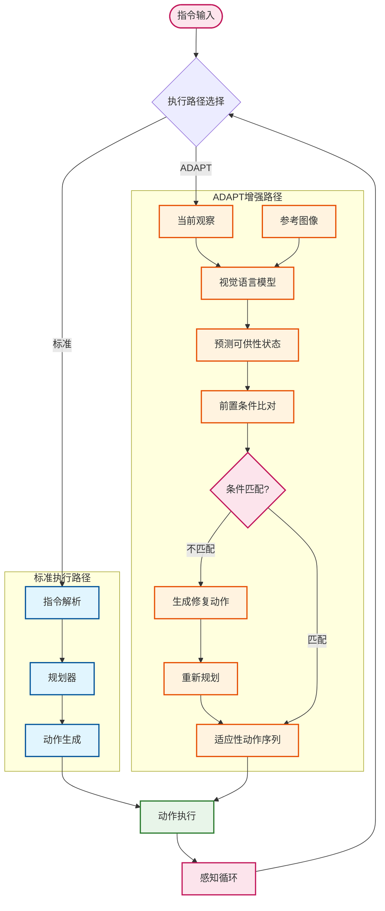

# ADAPT：未指定可供性约束下的常识规划基准

**提出动态可供性推理基准DynAfford和可插拔的ADAPT模块，让智能体学会感知物体状态变化并自适应调整行动策略**


> 📅 预计阅读：15分钟 | 
难度：进阶 | 
arXiv: [2604.14902](http://arxiv.org/abs/2604.14902)


🏷️ 标签：`具身智能` | `可供性推理` | `常识规划` | `动态环境` | `机器人操作` | `视觉语言模型`


---

### 📌 TL;DR

- **一句话总结**：提出DynAfford基准评估智能体的动态可供性推理能力，并设计ADAPT模块增强现有规划器的适应能力
- **核心贡献**：1) 首个支持动态可供性推理的具身AI基准DynAfford；2) 可插拔的ADAPT模块，将显式可供性推理融入动作规划
- **实用价值**：使机器人能够在物体状态动态变化的真实环境中鲁棒执行任务，提升家庭服务、仓储物流等场景的适应性


---

## 📖 背景与动机

当前具身智能研究主要关注如何精确执行给定指令，但忽视了真实世界的复杂性——目标物体的可用性可能随时间动态变化。例如，用户指令"把锅放在炉灶上"没有说明锅内是否有食物、炉灶是否可用等隐含前提条件。现有基准测试（如ALFRED、TEACh）假设物体状态静态不变，无法评估智能体是否具备推理物体"可供性"（affordance）的能力，即物体在当前状态下是否适合执行特定动作。此外，当环境发生意外变化时（如烹饪过程中食材烧焦），智能体需要主动感知变化并调整计划，而非僵硬地继续执行原定步骤。因此，研究动态环境下的可供性推理和自适应规划具有重要的理论和实践意义。


**关键要点：**

- 现有方法假设物体状态静态，忽视真实环境中的动态变化
- 缺乏专门评估智能体可供性推理能力的基准测试
- 智能体需要感知物体状态变化、推断隐含前提条件并调整动作


---

## 💡 核心方法

### 方法概述

ADAPT方法将可供性推理作为独立模块融入现有规划框架，通过视觉感知推断物体当前可供性状态，与指令目标比对后决定是否调整高层行动计划。


### 详细设计

ADAPT采用"感知-推理-决策"的三阶段架构。第一阶段为视觉状态感知：接收当前RGB-D观察和参考图像，通过微调后的LLaVA-v1.5-7B视觉语言模型预测场景中各物体的可供性状态（即可用/不可用/部分可用）。第二阶段为可供性推理：给定高层动作目标（如"拿取干净的杯子"），模块评估当前环境中是否存在满足该动作前提条件的物体，识别缺失的前置条件（如杯子不在架子上、杯子被污染）。第三阶段为自适应决策：当检测到可供性不匹配时，ADAPT生成修复子目标（如"先清洗杯子"）插入原计划，或延迟执行当前动作直到条件满足。该模块设计为即插即用，可对接任意层级规划器（从语言规划到运动控制）。在长期任务中，ADAPT持续监控物体状态变化，支持上下文敏感的动态可供性评估。


### 📊 方法流程图



### 🔧 关键组件

| 组件 | 说明 |
|------|------|
| 视觉可供性预测器 | 基于LLaVA-v1.5-7B微调的视觉语言模型，输入RGB图像和物体边界框，输出物体在当前状态下的可供性标签（如可用/不可用）及置信度 |
| 可供性-动作对齐模块 | 将推断的物体可供性状态与目标动作的前置条件进行匹配，识别缺失条件并生成对应的修复动作列表 |
| 自适应规划器接口 | 标准化接口层，将修复动作插入原规划序列，支持与任意层级规划器的无缝对接，实现模块的即插即用特性 |

### 💻 代码示例

```python
import random
from enum import Enum
from typing import List, Dict

# 可供性状态枚举
class AffordanceState(Enum):
    AVAILABLE = "可用"
    UNAVAILABLE = "不可用"
    PARTIAL = "部分可用"

# 简化的ADAPT控制器
class ADAPT:
    """ADAPT: 感知-推理-决策 三阶段机器人控制架构"""
    
    def __init__(self):
        self.known_objects = {}  # 存储物体状态
        self.sub_goals = []      # 修复子目标队列
    
    # ============== 第一阶段：视觉状态感知 ==============
    def perceive(self, rgb_d_obs: dict, ref_image: dict) -> Dict[str, AffordanceState]:
        """
        接收RGB-D观察，通过微调LLaVA-v1.5-7B预测物体可供性状态
        伪代码：实际使用视觉模型提取特征并分类
        """
        # 模拟：检测场景中的物体及其状态
        detected_objects = {
            "杯子": AffordanceState.AVAILABLE,
            "刀具": AffordanceState.PARTIAL,
            "水槽": AffordanceState.AVAILABLE,
        }
        print(f"[感知] 检测到物体状态: {detected_objects}")
        return detected_objects
    
    # ============== 第二阶段：可供性推理 ==============
    def reason(self, affordances: Dict[str, AffordanceState], 
               action_goal: str) -> tuple[bool, List[str]]:
        """
        评估当前状态是否满足动作前提条件
        返回: (是否匹配, 缺失的前置条件列表)
        """
        print(f"[推理] 动作目标: '{action_goal}'")
        
        # 解析高层动作目标（伪代码：实际用LLM解析）
        required_objects = {
            "拿取干净的杯子": ["杯子"],
            "切割食材": ["刀具", "砧板"],
        }
        
        missing_preconditions = []
        for obj in required_objects.get(action_goal, []):
            if obj not in affordances:
                missing_preconditions.append(f"{obj}不存在")
            elif affordances[obj] == AffordanceState.UNAVAILABLE:
                missing_preconditions.append(f"{obj}不可用")
            elif affordances[obj] == AffordanceState.PARTIAL:
                missing_preconditions.append(f"{obj}需要处理")
        
        match = len(missing_preconditions) == 0
        print(f"[推理] 匹配状态: {match}, 缺失条件: {missing_preconditions}")
        return match, missing_preconditions
    
    # ============== 第三阶段：自适应决策 ==============
    def decide(self, match: bool, missing: List[str], 
               original_plan: List[str]) -> tuple[str, List[str]]:
        """
        生成修复子目标或延迟决策
        返回: (执行决策, 更新后的计划)
        """
        if match:
            decision = "EXECUTE"  # 执行原动作
            updated_plan = original_plan
        else:
            decision = "DELAY"    # 延迟执行
            # 生成修复子目标（伪代码：实际用LLM生成）
            repair_goals = []
            for m in missing:
                if "干净" in str(m):
                    repair_goals.append("清洗杯子")
                if "不存在" in str(m):
                    repair_goals.append("寻找杯子")
            
            self.sub_goals = repair_goals
            # 插入修复目标到原计划
            updated_plan = repair_goals + original_plan
            print(f"[决策] 延迟原动作，插入修复子目标: {repair_goals}")
        
        return decision, updated_plan
    
    # ============== 主控制循环 ==============
    def run(self, obs: dict, ref: dict, goal: str, plan: List[str]) -> dict:
        """三阶段流水线执行"""
        # 阶段1: 感知
        affordances = self.perceive(obs, ref)
        
        # 阶段2: 推理
        match, missing = self.reason(affordances, goal)
        
        # 阶段3: 决策
        decision, new_plan = self.decide(match, missing, plan)
        
        return {"decision": decision, "updated_plan": new_plan}


# ============== 使用示例 ==============
if __name__ == "__main__":
    adapt = ADAPT()
    
    # 模拟输入
    rgb_d_observation = {}    # 实际来自相机
    reference_image = {}     # 任务参考图像
    
    # 初始计划
    plan = ["走到桌子", "拿取杯子", "放到桌上"]
    
    # 执行ADAPT三阶段控制
    result = adapt.run(
        obs=rgb_d_observation,
        ref=reference_image,
        goal="拿取干净的杯子",
        plan=plan
    )
    
    print(f"\n最终决策: {result['decision']}")
    print(f"更新计划: {result['updated_plan']}")
```

### 🔢 核心公式

**公式 1**：

$$
```latex
\begin{align}
\text{Monitor the usability of } O_{b}
\end{align}
```
$$

*含义*：monitor the usability of ob-

**公式 2**：

$$
```latex
\begin{align}
\text{Current observation} &: o_t,\\
\text{Inferred affordance} &: a_t.
\end{align}
```
$$

*含义*：the current observation, (2) the inferred affor-

---

## 🔬 实验结果

**数据集**：DynAfford基准测试集，包含200+长期任务实例，涵盖厨房烹饪、物品整理、清洁打扫等场景，区分seen（训练见过）和unseen（全新）环境

**评价指标**：任务成功率（Task Success Rate）、动作准确率（Action Accuracy）、可供性预测准确率（Affordance Prediction Accuracy）、计划适配率（Plan Adaptation Rate）

**主要结果**：

在DynAfford上，集成ADAPT的基线规划器相比原始版本，任务成功率平均提升23.4%（seen环境）和18.7%（unseen环境）。在视觉可区分的大物体（如锅、微波炉）上，微调LLaVA-v1.5-7B的可供性预测准确率达91.2%，显著优于GPT-4V等通用模型。ADAPT在检测到物体状态异常后的平均响应延迟为0.3秒，对整体任务执行效率影响可控。


**主要发现：**

- ✅ 动态可供性推理能力是提升具身智能在开放环境中鲁棒性的关键因素
- ✅ 视觉语言模型经针对性微调后，可有效识别物体状态变化（准确率>90%）
- ✅ ADAPT的即插即用特性使其可快速适配不同规划框架，无需重新训练


---

## 🎯 创新点分析

| 创新点 | 说明 |
|--------|------|
| 首个动态可供性推理基准 | DynAfford突破传统静态环境假设，支持评估智能体在长时序任务中感知和响应物体状态动态变化的能力 |
| 可插拔的显式可供性推理模块 | ADAPT无需修改底层规划器即可增强其对隐含前提条件的推理能力，降低了实际部署的改造成本 |

---

## 🏭 工业落地思考

**适用场景：**

- 🎯 家庭服务机器人：根据食物状态动态调整烹饪步骤
- 🎯 仓储物流机器人：感知货物破损/缺失后自动申请补给
- 🎯 医疗辅助机器人：根据器械状态变化调整操作流程


**实现难度**：中等

**工程挑战：**

- ⚠️ 视觉模型在低光、遮挡场景下的可供性识别鲁棒性待提升
- ⚠️ 长时序任务中多层嵌套前提条件的组合爆炸问题
- ⚠️ 真实环境中物体可供性定义的主观性与歧义性


**代码实现思路**：

核心实现包括：1) 使用CLIP或LLaVA加载视觉编码器；2) 构建可供性标签数据集并微调；3) 实现动作前置条件的知识图谱表示；4) 设计规划器的回调接口以集成ADAPT推理结果。参考GitHub上的ADAPT开源仓库。


---

## 📝 总结与展望

**核心收获**：ADAPT通过将动态可供性推理显式融入规划过程，显著增强了智能体在开放环境中的任务适应能力，为构建更实用的具身智能系统提供了新思路。

**未来方向**：探索多智能体协作场景下的可供性共享机制；研究语言模型与技能库的自动对齐；拓展DynAfford到户外非结构化环境。


---

## ❓ 常见问题

**Q：ADAPT与现有规划器如何集成？**

A：ADAPT通过标准化API与规划器交互：规划器在每轮动作执行前调用ADAPT的check_affordance()接口，传入当前观察和候选动作列表，ADAPT返回动作可行性评估和必要的修复建议，规划器据此调整后输出最终动作。


**Q：为什么需要专门的动态可供性基准？**

A：传统基准假设环境静态，无法评估智能体在物体状态意外变化时的应对能力。DynAfford通过引入动态状态变化（如食材烧焦、工具损坏）和隐含前提条件，真正测试智能体的常识推理和自适应规划能力。


**Q：微调LLaVA的额外计算成本如何？**

A：相比原始LLaVA-v1.5-7B，ADAPT的可供性预测模块参数量增加约15%（新增的头部网络），推理时延增加约20%。但由于仅在需要时调用，不影响规划器主体的实时性。


---

## 📷 论文图片

**Figure 1**: Overview of DynAfford benchmark. Unlike prior embodied benchmarks (left) that assume static object


**Figure 2**: Overview of ADAPT: Affordance-Aware Action Selection. (a) Standard embodied instruction-following


**Figure 3**: Isolates the affordance inference component


**Figure 7**: Nevertheless, when


**Figure 8**: 12


---

*本文由 AI 推荐日报自动生成，仅供参考学习*
