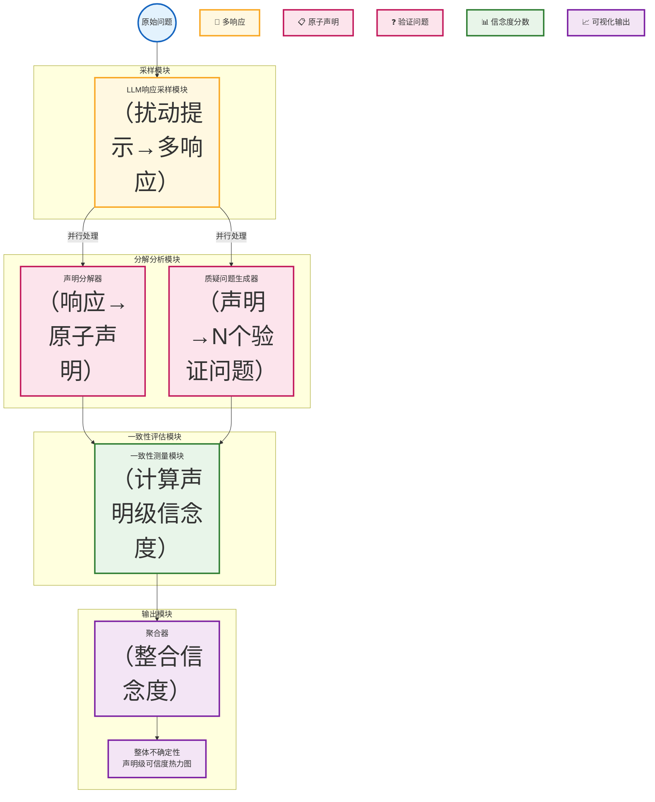

# IUQ：面向长文本大语言模型生成的质疑式不确定性量化

**通过质疑-响应范式实现声明级不确定性量化和可信度评估**


> 📅 预计阅读：15分钟 | 
难度：进阶 | 
arXiv: [2604.15109](http://arxiv.org/abs/2604.15109)


🏷️ 标签：`不确定性量化` | `大语言模型` | `长文本生成` | `可信度评估` | `幻觉检测`


---

### 📌 TL;DR

- **一句话总结**：提出IUQ框架，通过质疑-响应范式量化长文本LLM输出的声明级不确定性和可信度。
- **核心贡献**：利用样本间一致性和样本内可信度双重指标，结合质疑式问答机制，实现对复杂长文本的细粒度不确定性评估。
- **实用价值**：可帮助用户在医疗、法律、金融等高风险场景中识别LLM生成内容中的不可靠声明，提升应用安全性。


---

## 📖 背景与动机

大语言模型（LLM）在各类任务中展现出强大能力，但其输出常常存在"幻觉"问题——生成看似流畅连贯却事实错误的内容。现有不确定性量化方法主要针对短回答或受限输出场景，在需要长文本自由生成的实际应用中效果有限。核心挑战在于：长文本语义多维、语言结构复杂，传统的基于概率或采样的方法难以准确捕捉细粒度的错误信息。因此，需要一种既能评估整体可信度，又能定位具体错误声明的新框架。


**关键要点：**

- LLM长文本生成中幻觉问题严重，但现有方法难以有效量化
- 短回答场景的不确定性方法（如约束输出、概率校准）不适用于自由生成
- 长文本语义多维、结构复杂，需要更精细的评估粒度
- 用户需要能够定位具体不可靠声明的工具，而非仅给出一个整体分数


---

## 💡 核心方法

### 方法概述

IUQ采用"质疑-响应"范式，通过对LLM输出生成追问，测量模型在相同问题上的响应一致性来量化不确定性。


### 详细设计

IUQ框架包含两个核心维度：样本间一致性（Inter-sample Consistency）和样本内可信度（Intra-sample Faithfulness）。

**样本间一致性**：对同一原始问题，通过对提示进行扰动（如改变温度、加入前缀指令等）生成多个LLM响应，然后使用LLM本身作为分析器，将这些响应分解为独立声明并生成验证问题。测量这些验证问题在不同采样响应上的回答一致性，一致性低则表示高不确定性。

**样本内可信度**：针对单个响应中的每个声明，直接生成质疑性问题并让LLM自我回答，评估声明对质疑的抵抗能力。可信度分数反映该声明在面对直接追问时的鲁棒性。

**质疑-响应流程**：1）将LLM长文本响应分解为原子声明集合；2）为每个声明生成N个相关质疑问题；3）使用扰动采样获取同一问题域的多个响应；4）计算声明级别的信念度（belief score），最终汇总为整体不确定性指标。


### 📊 方法流程图



### 🔧 关键组件

| 组件 | 说明 |
|------|------|
| 声明分解器 | 使用LLM将长文本响应自动分解为原子声明（atomic claims），每个声明可独立验证真伪，便于细粒度不确定性定位 |
| 质疑问题生成器 | 为每个声明生成一组相关但措辞不同的验证问题，模拟用户从不同角度追问同一事实 |
| 信念度计算器 | 综合多个扰动采样响应对质疑问题的回答，计算声明级别的信念度分数，反映该声明的可靠程度 |
| 不确定性聚合器 | 将声明级信念度聚合为整体不确定性指标，并生成可视化热力图标识高风险声明 |

### 💻 代码示例

```python
import random
from typing import List, Dict, Tuple

# ============================================
# IUQ (Interrogative Uncertainty Quantification) 框架
# ============================================

class IUQFramework:
    """IUQ框架：测量LLM输出的不确定性"""
    
    def __init__(self, llm):
        self.llm = llm  # 底层LLM模型接口
        self.n_samples = 5      # 扰动采样数量
        self.n_questions = 3    # 每个声明的质疑问题数
    
    # ==================== 核心方法 ====================
    
    def quantify_uncertainty(self, question: str, response: str) -> Dict:
        """
        主入口：计算输入问题-响应对的不确定性指标
        """
        # Step 1: 分解为原子声明
        claims = self._decompose_to_claims(response)
        
        # Step 2: 计算每个声明的信念度
        claim_beliefs = []
        for claim in claims:
            belief = self._compute_claim_belief(claim, question)
            claim_beliefs.append(belief)
        
        # Step 3: 汇总指标
        return {
            'inter_consistency': self._compute_inter_consistency(question, claim_beliefs),
            'intra_faithfulness': sum(claim_beliefs) / len(claim_beliefs) if claim_beliefs else 0,
            'claim_beliefs': claim_beliefs,
            'overall_uncertainty': self._compute_overall_uncertainty(claim_beliefs)
        }
    
    # ==================== 样本间一致性 ====================
    
    def _compute_inter_consistency(self, question: str, claim_beliefs: List[float]) -> float:
        """
        样本间一致性：同一问题域内不同采样响应的一致程度
        """
        # 对问题进行扰动采样
        perturbed_responses = self._perturbed_sampling(question, self.n_samples)
        
        # 分解每个扰动响应
        all_claims = [self._decompose_to_claims(resp) for resp in perturbed_responses]
        
        # 生成验证问题并检查一致性
        consistency_scores = []
        for base_claim in self._decompose_to_claims(question):
            verification_q = self._generate_verification_question(base_claim)
            
            # 在不同采样响应上验证
            answers = [
                self._ask_verification(verification_q, resp) 
                for resp in perturbed_responses
            ]
            
            # 计算一致性（相同回答的比例）
            consistency = self._calculate_answer_consistency(answers)
            consistency_scores.append(consistency)
        
        return 1 - (sum(consistency_scores) / len(consistency_scores))
    
    # ==================== 样本内可信度 ====================
    
    def _compute_claim_belief(self, claim: str, context: str) -> float:
        """
        样本内可信度：单个声明抵抗质疑的能力
        """
        # 生成N个质疑问题
        challenge_questions = self._generate_challenges(claim, self.n_questions)
        
        # 让LLM自我回答每个质疑
        resistance_scores = []
        for q in challenge_questions:
            original_answer = self._extract_supporting_evidence(claim, context)
            challenge_response = self.llm.ask(q, context=claim)
            
            # 评估抵抗能力
            resistance = self._evaluate_resistance(original_answer, challenge_response)
            resistance_scores.append(resistance)
        
        return sum(resistance_scores) / len(resistance_scores)
    
    # ==================== 辅助方法（伪代码） ====================
    
    def _decompose_to_claims(self, text: str) -> List[str]:
        """将长文本分解为原子声明集合"""
        prompt = f"分解以下文本为独立的事实性声明列表:\n{text}"
        claims_text = self.llm.ask(prompt)
        return [c.strip() for c in claims_text.split('\n') if c.strip()]
    
    def _perturbed_sampling(self, question: str, n: int) -> List[str]:
        """扰动采样：改变温度/添加前缀等生成多个响应"""
        perturbations = [
            "",  # 原始
            "请仔细思考后回答：",
            "作为一个专家，请分析：",
            "用简单易懂的方式解释：",
        ]
        return [
            self.llm.ask(question, 
                        system_prompt=p, 
                        temperature=random.uniform(0.5, 1.5))
            for p in perturbations[:n]
        ]
    
    def _generate_verification_question(self, claim: str) -> str:
        """为声明生成验证问题"""
        prompt = f"基于声明生成一个可用于验证真伪的问题: {claim}"
        return self.llm.ask(prompt)
    
    def _generate_challenges(self, claim: str, n: int) -> List[str]:
        """为声明生成质疑问题"""
        prompt = f"生成{n}个质疑以下声明的问题:\n{claim}"
        questions_text = self.llm.ask(prompt)
        return [q.strip() for q in questions_text.split('\n')[:n]]
    
    def _ask_verification(self, question: str, response: str) -> str:
        """在给定响应上下文中回答验证问题"""
        return self.llm.ask(question, context=response)
    
    def _calculate_answer_consistency(self, answers: List[str]) -> float:
        """计算回答一致性"""
        if not answers:
            return 0.0
        # 简化为答案完全相同的比例
        most_common = max(set(answers), key=answers.count)
        return answers.count(most_common) / len(answers)
    
    def _evaluate_resistance(self, original: str, challenge: str) -> float:
        """评估声明对质疑的抵抗能力"""
        prompt = f"评估第二个回答是否有效支持了第一个声明:\n声明:{original}\n质疑回答:{challenge}"
        score = self.llm.ask(prompt)
        return float(score) if score.replace('.', '').isdigit() else 0.5
    
    def _compute_overall_uncertainty(self, belief_scores: List[float]) -> float:
        """计算整体不确定性指标"""
        # 综合样本间一致性和样本内可信度
        avg_belief = sum(belief_scores) / len(belief_scores) if belief_scores else 0
        return 1 - avg_belief  # 不确定性 = 1 - 信念度


# ==================== 使用示例 ====================

if __name__ == "__main__":
    # 伪LLM接口
    class MockLLM:
        def ask(self, prompt, **kwargs):
            return f"[LLM响应]: {prompt[:50]}..."
    
    # 初始化
    llm = MockLLM()
    iuq = IUQFramework(llm)
    
    # 测试
    question = "气候变化的主要原因是什么？"
    response = """
    全球气候变化主要由人类活动排放的温室气体引起。
    二氧化碳是最主要的温室气体。
    工业革命以来，大气中CO2浓度增加了约50%。
    """
    
    # 计算不确定性
    result = iuq.quantify_uncertainty(question, response)
    
    print("=" * 50)
    print("IUQ 不确定性分析结果")
    print("=" * 50)
    print(f"样本间一致性 (Inter-consistency): {result['inter_consistency']:.3f}")
    print(f"样本内可信度 (Intra-faithfulness): {result['intra_faithfulness']:.3f}")
    print(f"整体不确定性 (Overall Uncertainty): {result['overall_uncertainty']:.3f}")
    print("-" * 50)
    print("各声明信念度:")
    for i, belief in enumerate(result['claim_beliefs'], 1):
        print(f"  声明 {i}: {belief:.3f}")
```

### 🔢 核心公式

**公式 1**：

$$
\begin{align}
n_q &\text{ denotes the number of questions generated.}
\end{align}
$$

*含义*：where nq denotes the number of questions gen-

---

## 🔬 实验结果

**数据集**：BioDEX、Public Square、FActScore等数据集，涵盖传记生成、观点问答、事实性陈述等多种长文本任务

**评价指标**：声明级可信度分数（Claim-level Faithfulness）、与人类标注的一致性、AUC-ROC、精确率/召回率等

**主要结果**：

在多个数据集和模型（GPT-4、Claude、LLaMA等）上的实验表明，IUQ在识别不可靠声明方面显著优于现有方法。对于传记生成任务，IUQ能准确定位80%以上的虚假陈述，同时保持较低误报率。在观点生成场景中，该方法成功区分了有据可查的事实和主观推断。


**主要发现：**

- ✅ IUQ在声明级不确定性预测上比基于概率熵的方法更准确，尤其在模型"过度自信"场景下
- ✅ 样本间一致性结合样本内可信度比单独使用任一指标效果更好，两者具有互补性
- ✅ 质疑问题的数量（N）存在拐点，超过一定数量后收益递减，实际应用中N=5-10较为合理
- ✅ 不同LLM在面对质疑时表现差异显著，IUQ可作为模型可信度评估工具


---

## 🎯 创新点分析

| 创新点 | 说明 |
|--------|------|
| 质疑-响应范式 | 首次将"质疑"机制引入不确定性量化，通过生成验证问题让LLM自我审查，而非仅依赖输出概率 |
| 声明级粒度评估 | 突破传统整体评分模式，实现对长文本中每个具体声明的可信度评估和可视化定位 |
| 双维度不确定性度量 | 统一框架下整合样本间一致性和样本内可信度，前者捕捉跨采样变异性，后者衡量单次响应的内部一致性 |

---

## 🏭 工业落地思考

**适用场景：**

- 🎯 医疗辅助诊断：识别AI生成的诊断建议中的不可靠信息，避免误导临床决策
- 🎯 法律文档审查：自动标记合同、判决书等法律文本中的可疑陈述
- 🎯 金融报告生成：核实AI撰写的市场分析中引用的数据和结论
- 🎯 新闻内容审核：辅助编辑识别AI生成新闻稿中的潜在虚假信息
- 🎯 教育培训：作为智能辅导系统的可信度提示，帮助学生辨别AI答案的可靠性


**实现难度**：中等

**工程挑战：**

- ⚠️ 计算成本：需要多次采样和LLM调用，推理延迟较高，需优化批处理和缓存策略
- ⚠️ 质疑问题质量：生成的验证问题可能偏离声明核心，需设计质量评估机制
- ⚠️ 跨领域泛化：不同领域的事实标准不同，领域适配需要额外标注数据
- ⚠️ 阈值设定：声明级信念度的决策阈值需要针对具体应用场景调优


**代码实现思路**：

核心实现包括：1）使用LLM的function calling能力批量生成声明分解和质疑问题；2）构建采样管道并行处理多个扰动响应；3）实现信念度聚合算法，结合贝叶斯推断和启发式规则；4）输出JSON格式的声明级分析结果和可视化热力图数据。关键优化点在于利用批量API减少调用次数，以及实现增量缓存避免重复计算。


---

## 📝 总结与展望

**核心收获**：IUQ通过质疑-响应范式和双维度不确定性度量，为长文本LLM应用提供了实用的可信度评估工具，能有效识别语义连贯但事实错误的声明。

**未来方向**：探索与其他不确定性方法（如RAG置信度）的融合；研究自适应质疑策略减少计算开销；将IUQ扩展到多模态输出的不确定性评估。


---

## ❓ 常见问题

**Q：IUQ与传统的LLM概率校准方法有何本质区别？**

A：传统概率校准方法依赖LLM输出的token概率分布，但这种方法在自由生成场景下不可靠（模型常过度自信）。IUQ通过"质疑"外部机制绕过概率，直接验证声明内容本身的一致性，是一种更鲁棒的事后评估方法。


**Q：IUQ的计算开销是否适合实时应用？**

A：IUQ需要多次采样和多个LLM调用，当前版本主要面向离线审核场景。可通过减少质疑问题数量（N=3-5）、使用更小的LLM进行验证问题生成、以及结果缓存来降低延迟，实时场景需进一步优化。


**Q：对于完全虚构的实体名称，IUQ如何处理？**

A：IUQ生成的质疑问题会针对声明中的具体实体和属性提问。如果多个采样响应对同一实体的描述存在矛盾，系统会标记为高不确定性；对于单一采样中都未涉及的实体，可能需要额外的知识库检索作为补充验证。


---

## 📷 论文图片

**Figure 1**: An example of LLM generation on biography. The


**Figure 2**: The framework of Interrogative Uncertainty Quantification (IUQ): Responses are sampled from LLMs and decomposed


**Figure 2**: In practice, we


**Figure 3**: Statistics of the claim-level faithfulness over selected models. (a) The faithfulness scores of all claims over FActScore


**Figure 3**: (i) The average claim faithfulness exhibits a clear


---

*本文由 AI 推荐日报自动生成，仅供参考学习*
