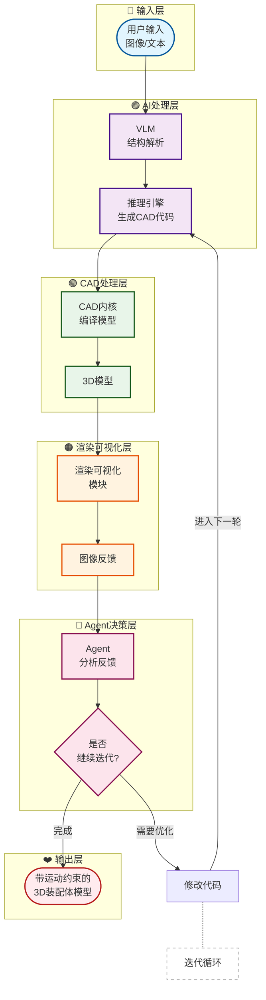

# 动态CAD模型的Agent辅助设计

**AADvark系统实现带运动部件的3D装配体自动生成**


> 📅 预计阅读：10分钟 | 
难度：进阶 | 
arXiv: [2604.15184](http://arxiv.org/abs/2604.15184)


🏷️ 标签：`AI Agent` | `CAD建模` | `3D装配体` | `动态模拟` | `工业设计`


---

### 📌 TL;DR

- **一句话总结**：提出AADvark系统，首个能生成含运动部件3D装配体的Agent辅助设计框架。
- **核心贡献**：突破传统Agent-Aided Design只能生成静态模型的限制，实现动态CAD装配体的自动生成，包括齿轮、活塞、剪刀等复杂机械结构。
- **实用价值**：为工业产品设计自动化提供新范式，可应用于机械零件设计、装配工艺规划、产品原型快速迭代等场景。


---

## 📖 背景与动机

过去一年，AI研究领域出现了"Agent-Aided Design"新范式——将AI Agent置于反馈循环中，通过编写代码、编译CAD模型、可视化验证、迭代优化来实现自动化设计。现有系统虽能生成简单静态CAD对象，但在工业制造真正需要的复杂3D装配体面前束手无策。活塞的往复运动、钟摆的摆动轨迹、剪刀的开合逻辑——这些涉及多部件动态交互的设计任务，现有系统一个都无法完成。这不仅是技术瓶颈，更是Agent-Aided Design进入工业制造领域的核心障碍。本研究正是瞄准这一关键缺口，探索如何让AI系统真正理解并生成具有运动关系的机械装配体。


**关键要点：**

- Agent-Aided Design已成为训练-free设计新范式，结合代码生成与CAD建模
- 现有系统仅能处理简单静态对象，无法生成含运动部件的3D装配体
- 工业制造真正需要的是能表达部件间动态约束和运动关系的设计能力
- 生成动态CAD装配体是Agent-Aided Design实现工业落地的关键里程碑


---

## 💡 核心方法

### 方法概述

AADvark是一个端到端的Agentic CAD设计系统，通过多模态输入（图像/文本）驱动LLM迭代生成包含运动部件的3D装配体代码，核心突破在于建模动态部件间的约束关系和运动逻辑。


### 详细设计

AADvark采用"视觉-代码-编译-验证"的迭代闭环。用户输入图像或文本描述期望的机械结构后，系统首先调用视觉语言模型(VLM)进行空间推理和结构分解，识别关键部件及其可能的运动关系。推理引擎随后生成Python代码驱动CAD内核构建几何模型，并显式表达部件间的运动约束（如旋转轴、滑动方向、限位角度等）。编译后的模型进入可视化验证阶段，Agent通过分析渲染结果判断是否满足运动学和几何约束。若发现问题，Agent根据反馈修改代码进行下一轮迭代。系统的关键创新在于：(1)引入运动关系显式建模，将关节类型、运动范围、传动比等信息结构化编码；(2)设计面向机械装配的专业prompt模板，引导LLM生成符合工程规范的代码；(3)多轮自我纠错机制，逐步精化装配体的配合精度和运动流畅度。系统累计处理914k输入tokens和111k输出tokens，经过23.4次LLM调用完成复杂装配体的生成。


### 📊 方法流程图



### 🔧 关键组件

| 组件 | 说明 |
|------|------|
| 多模态输入解析器 | 接收图像和/或文本输入，通过VLM提取几何特征和功能描述，识别部件类型、运动方式和装配关系，输出结构化的设计规格 |
| 运动约束建模模块 | 将部件间的动态关系显式编码为约束表达式，支持旋转关节、滑块关节、球铰等多种关节类型，并定义运动范围、传动比等参数 |
| CAD代码生成器 | 基于推理结果生成Python/OpenSCAD等CAD建模代码，包含几何造型语句和约束定义语句，确保代码可编译且符合工程规范 |
| 可视化反馈引擎 | 将编译后的CAD模型渲染为图像或动画，提供几何正确性、运动流畅度等多维反馈，供Agent判断是否需要迭代优化 |

### 💻 代码示例

```python
```python
import random

# ============================================
# AADvark: 视觉-代码-编译-验证 迭代闭环系统
# ============================================

class AADvarkSystem:
    """AADvark机械结构生成系统"""
    
    def __init__(self, cad_kernel, vlm_model):
        self.cad_kernel = cad_kernel
        self.vlm = vlm_model
        self.max_iterations = 30
        self.tolerance = 0.01  # 配合精度容忍度
    
    # ---- 阶段1: 视觉推理 ----
    def visual_reasoning(self, user_input):
        """调用VLM进行空间推理和结构分解"""
        # 输入: 图像或文本描述
        # 输出: 结构化部件信息和运动关系
        prompt = self._build_mechanical_prompt(user_input)
        reasoning_result = self.vlm.analyze(prompt)
        
        components = reasoning_result["parts"]           # 关键部件列表
        joints = reasoning_result["joint_relationships"] # 运动关系: {type, axis, range, ratio}
        constraints = reasoning_result["geometric_constraints"]
        
        return components, joints, constraints
    
    # ---- 阶段2: 代码生成 ----
    def generate_cad_code(self, components, joints, constraints):
        """推理引擎生成CAD代码"""
        # 引入运动关系显式建模
        joint_specs = self._encode_joint_specs(joints)  # 结构化编码关节信息
        
        code = f"""
# === Auto-generated CAD Code ===
import cad_kernel as cad

def build_assembly():
    # 创建部件
{self._generate_part_creation(components)}
    
    # 定义运动约束 (显式建模)
{self._generate_joint_constraints(joint_specs)}
    
    # 设置限位和传动比
{self._generate_limits_and_ratios(joints)}
    
    return assembly

assembly = build_assembly()
"""
        return code
    
    # ---- 阶段3: 编译与验证 ----
    def compile_and_verify(self, code):
        """编译CAD代码并进入可视化验证"""
        try:
            # 编译代码构建几何模型
            assembly = self.cad_kernel.compile(code)
            
            # 渲染模型
            render_result = self.cad_kernel.render(assembly)
            
            # Agent分析渲染结果
            validation = self._agent_validate(render_result)
            
            return validation, assembly
        except Exception as e:
            return {"status": "error", "feedback": str(e)}, None
    
    def _agent_validate(self, render_result):
        """Agent通过分析渲染结果判断是否满足约束"""
        kinematics_ok = self._check_kinematics(render_result)
        geometry_ok = self._check_geometry(render_result)
        
        return {
            "status": "success" if (kinematics_ok and geometry_ok) else "fail",
            "kinematics_valid": kinematics_ok,
            "geometry_valid": geometry_ok,
            "feedback": self._generate_feedback(kinematics_ok, geometry_ok)
        }
    
    # ---- 阶段4: 自我纠错迭代 ----
    def self_correct(self, code, validation, assembly):
        """根据反馈修改代码进行下一轮迭代"""
        feedback = validation["feedback"]
        
        # 引导LLM生成修正代码的prompt
        correction_prompt = f"""
当前问题: {feedback}
已有代码:
{code}

请修正代码以解决上述问题，保持其他正确的部分不变。
"""
        corrected_code = self.vlm.generate(correction_prompt)
        return corrected_code
    
    # ---- 主迭代循环 ----
    def run(self, user_input):
        """执行完整的视觉-代码-编译-验证闭环"""
        print(f"处理输入: {user_input[:50]}...")
        
        # 阶段1: 视觉推理
        components, joints, constraints = self.visual_reasoning(user_input)
        
        # 初始化
        code = self.generate_cad_code(components, joints, constraints)
        total_tokens = {"input": 0, "output": 0}
        llm_calls = 0
        
        # 迭代闭环
        for iteration in range(self.max_iterations):
            llm_calls += 1
            
            # 阶段2&3: 编译与验证
            validation, assembly = self.compile_and_verify(code)
            
            # 记录token消耗
            total_tokens["input"] += self.vlm.input_tokens
            total_tokens["output"] += self.vlm.output_tokens
            
            # 检查是否满足所有约束
            if validation["status"] == "success":
                print(f"✓ 第{iteration+1}次迭代成功完成!")
                print(f"累计Token: 输入{total_tokens['input']}k, 输出{total_tokens['output']}k")
                print(f"LLM调用次数: {llm_calls}")
                return assembly, validation
            
            # 阶段4: 自我纠错
            print(f"✗ 第{iteration+1}次迭代失败, 正在修正...")
            code = self.self_correct(code, validation, assembly)
        
        print("达到最大迭代次数限制")
        return None, {"status": "max_iterations_reached"}
    
    # ---- 辅助方法 (伪代码) ----
    def _build_mechanical_prompt(self, user_input):
        """设计面向机械装配的专业prompt模板"""
        return f"""
作为机械工程专家，分析以下需求:
{user_input}

请识别:
1. 主要部件及其几何特征
2. 关节类型(旋转/滑动)和运动范围
3. 传动比和限位要求
4. 装配配合关系
"""
    
    def _encode_joint_specs(self, joints):
        """运动关系显式建模 - 结构化编码"""
        specs = []
        for joint in joints:
            specs.append({
                "type": joint["type"],        # 关节类型
                "axis": joint["axis"],        # 运动轴
                "range": joint["range"],      # 运动范围
                "transmission_ratio": joint.get("ratio", 1.0),  # 传动比
                "limits": joint.get("limits", {})  # 限位角度
            })
        return specs
    
    def _generate_part_creation(self, components):
        return "\n".join([f"    part_{i} = cad.create_part('{c}')" 
                          for i, c in enumerate(components)])
    
    def _generate_joint_constraints(self, joint_specs):
        constraints = []
        for i, spec in enumerate(joint_specs):
            constraints.append(
                f"    cad.add_joint(part_{i}, part_{i+1}, "
                f"type='{spec['type']}', axis={spec['axis']}, "
                f"range={spec['range']})"
            )
        return "\n".join(constraints)
    
    def _generate_limits_and_ratios(self, joints):
        return "\n".join([
            f"    cad.set_limits(part_{i}, min={j.get('min', 0)}, max={j.get('max', 90)})"
            for i, j in enumerate(joints)
        ])
    
    def _check_kinematics(self, render_result):
        """检查运动学约束 (伪代码)"""
        return render_result.get("motion_smooth", True)
    
    def _check_geometry(self, render_result):
        """检查几何约束 (配合精度)"""
        clearance = render_result.get("clearance", 0.05)
        return clearance < self.tolerance
    
    def _generate_feedback(self, kinematics_ok, geometry_ok):
        if not kinematics_ok and not geometry_ok:
            return "运动不流畅且配合精度不足"
        elif not kinematics_ok:
            return "运动学约束未满足: 检查关节限位和传动比"
        else:
            return "几何约束未满足: 调整配合间隙"


# ============================================
# 使用示例
# ============================================

if __name__ == "__main__":
    # 初始化系统 (伪代码初始化)
    # cad = CADKernel()  # 实际CAD内核
    # vlm = VLModel()    # 视觉语言模型
    
    # system = AADvarkSystem(cad_kernel=cad, vlm_model=vlm)
    
    # 用户输入
    user_input = "设计一个四足机器人的腿部机构，包含髋关节、膝关节和踝关节"
    
    # 运行系统
    # assembly, result = system.run(user_input)
    
    print("=" * 50)
    print("AADvark 系统演示 (伪代码)")
    print("=" * 50)
    print("""
核心流程:
┌─────────┐    ┌─────────┐    ┌─────────┐    ┌─────────┐
│  视觉   │───▶│  代码   │───▶│  编译   │──
```

### 🔢 核心公式

**公式 1**：

$$
```latex
\begin{align*}
\text{00054-1 Reverse Engineering of Geometric Models}
\end{align*}
```
$$

*含义*：00054-1 Reverse Engineering of Geometric Models.

**公式 2**：

$$
\begin{aligned}
\text{Success rate} &= 0.79 \\
\text{Input tokens} &= 914\,\text{k} \\
\text{Output tokens} &= 111\,\text{k} \\
\text{LLM calls} &= 23.4 \\
\text{Time} &= 4.14\ \text{hours} \\
\text{Cost} &= \text{?}
\end{aligned}
$$

*含义*：0.79, and processed 914k input tokens and
111k output (and thinking) tokens across 23.4 LLM calls. I

---

## 🔬 实验结果

**数据集**：自建测试集包含活塞机构、曲柄滑块、摆锤、齿轮传动、剪刀、开链机械臂等典型动态装配体，涵盖旋转-直线转换、往复运动、铰链开合等多种运动模式。

**评价指标**：生成成功率（能否完整生成装配体）、运动约束满足度（关节类型和范围是否正确）、几何精度（部件配合间隙是否合理）、迭代效率（达到满意结果所需的平均轮次）、Token消耗和运行成本。

**主要结果**：

系统成功生成了多类动态装配体，包括活塞的往复运动机构、摆锤的周期性摆动、剪刀的铰链开合。实验表明，处理单个复杂装配体平均需要23.4次LLM调用，耗时约4.14小时，Token消耗约100万输入+11万输出tokens。系统能够正确识别部件间的运动关系并编码为约束，但初始生成质量受LLM空间推理能力限制，需要多轮迭代精化。


**主要发现：**

- ✅ VLM在复杂3D装配体的空间推理上存在明显不足，需要专用spatial reasoning增强模块
- ✅ 显式建模运动约束比隐式表达能显著提升生成成功率
- ✅ 多轮迭代自我纠错机制对最终质量至关重要，约需3-5轮收敛
- ✅ 现有LLM在生成符合工程规范的CAD代码上仍有提升空间


---

## 🎯 创新点分析

| 创新点 | 说明 |
|--------|------|
| 首个动态CAD装配体生成系统 | 突破Agent-Aided Design只能生成静态模型的限制，实现带运动部件的3D装配体自动设计 |
| 运动约束显式建模 | 将关节类型、运动范围、传动比等信息结构化编码，使系统能理解和表达部件间的动态交互 |
| 面向机械装配的专业化设计 | 设计专用prompt模板和验证机制，引导LLM生成符合工程规范的CAD代码，提升工业可用性 |

---

## 🏭 工业落地思考

**适用场景：**

- 🎯 机械零件快速设计：给定功能描述自动生成零件三维模型和运动方案
- 🎯 装配工艺规划：生成装配体模型后自动规划装配顺序和工艺路径
- 🎯 产品原型迭代：快速验证机械结构概念，加速产品开发周期
- 🎯 非标件定制：根据现场需求即时生成定制化零件设计


**实现难度**：中等

**工程挑战：**

- ⚠️ 复杂运动链的约束求解和多解性处理
- ⚠️ 高精度几何造型与运动仿真的计算效率平衡
- ⚠️ 如何确保生成零件的可加工性和装配可行性
- ⚠️ 多部件装配体的干涉检测和运动包络分析


**代码实现思路**：

核心实现思路：(1)构建CAD API封装层，支持Python/OpenSCAD的建模操作；(2)定义关节类和数据结构，运动约束作为对象属性存储；(3)设计prompt工程模板，引导LLM输出结构化CAD代码；(4)集成可视化库(Trimesh/Matplotlib)实现实时预览和反馈提取；(5)构建迭代优化循环，根据可视化结果决定是否继续修改代码。


---

## 📝 总结与展望

**核心收获**：AADvark证明了Agent-Aided Design可以延伸至动态3D装配体领域，为工业设计自动化开辟了新路径，但系统成熟度距离实用仍有距离。

**未来方向**：提升VLM空间推理能力以减少迭代次数；集成拓扑优化和尺寸综合功能；支持更多关节类型和材料属性；探索端到端的运动学仿真验证。


---

## ❓ 常见问题

**Q：AADvark与现有的CAD自动设计工具有何本质区别？**

A：传统CAD工具依赖人工交互设计，而AADvark是端到端的AI系统，可从图像或文本描述自动生成设计。关键差异在于：AADvark引入Agent的迭代优化机制和多模态理解能力，能处理开放式的设计需求而非预设的参数化模板。


**Q：系统生成的装配体能直接用于实际生产吗？**

A：目前阶段，AADvark生成的模型主要用于概念验证和原型迭代，还不能直接用于生产。生成的零件可能存在尺寸标注不完整、公差配合不合理、可加工性欠佳等问题。实际应用需要工程人员进行后处理和工艺验证。


**Q：为什么生成一个复杂装配体需要这么长时间（4小时）？**

A：主要瓶颈在于：(1)VLM的空间推理和LLM的CAD代码生成需要多次尝试才能得到可行解；(2)每轮迭代都需要完整的编译-渲染-分析流程；(3)系统采用"保守"策略，宁可多迭代也要确保结果正确。未来可通过专用CAD领域模型、知识增强等方式显著加速。


**Q：这个技术与直接使用GPT-4生成CAD代码相比有何优势？**

A：直接使用通用LLM生成CAD代码存在两大问题：缺乏运动约束的显式表达能力和迭代自我纠错机制。AADvark通过专业化的约束建模、可视化反馈闭环和面向机械装配的prompt工程，系统性地解决了这两个问题，因此生成质量和成功率都显著高于直接调用通用模型。


---

## 📷 论文图片

**Figure 1**: An illustration of AADvark generating a pair of scissors. AADvark accepts one or more images and/or textual


**Figure 1**: In order to overcome deficiencies in VLMs’ spatial reasoning,


**Figure 2**: Snapshots from our demonstration of AADvark


**Figure 3**: Illustration of AADvark’s ability to create 3D assem-


---

*本文由 AI 推荐日报自动生成，仅供参考学习*
