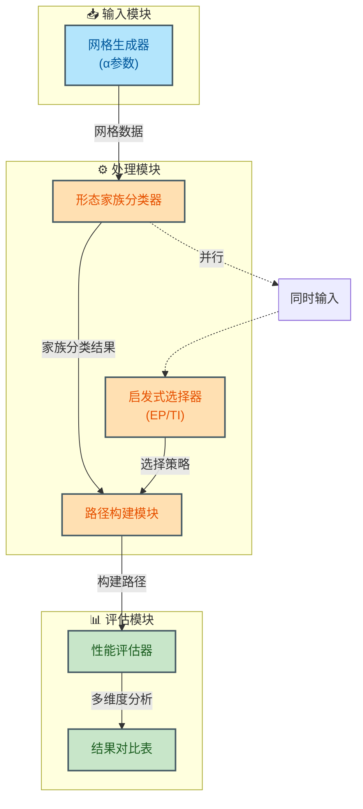

# 不规则六边形网格海上覆盖路径规划启发式方法基准评测

**针对非均匀六边形网格的经典CPP启发式方法系统性性能评估与工业应用指南**


> 📅 预计阅读：15分钟 | 
难度：进阶 | 
arXiv: [2604.15202](http://arxiv.org/abs/2604.15202)


🏷️ 标签：`覆盖路径规划` | `六边形网格` | `启发式算法` | `海上自主航行` | `机器人导航`


---

### 📌 TL;DR

- **一句话总结**：系统评估经典启发式在不规则六边形网格上的覆盖性能，为海上作业提供实用选择依据。
- **核心贡献**：首次对经典CPP启发式方法在不规则六边形网格上进行大规模基准测试，提出α形变参数族建模不规则性，并揭示EP与TI策略的适用边界。
- **实用价值**：为海上巡逻、环境监测、搜救等场景的路径规划器选型提供实证依据，降低实际部署风险。


---

## 📖 背景与动机

覆盖路径规划（Coverage Path Planning, CPP）是自主系统领域的核心问题，目标是在给定区域内规划一条访问所有目标点的无重复路径。传统研究多基于规则矩形网格，而海上环境由于岛屿分布、礁石阻碍等因素，往往呈现不规则六边形网格结构。六边形网格相比方形网格具有更均匀的邻接关系和更少的转向角度，但在不规则形变下如何保持覆盖效率仍是开放问题。本研究聚焦于：经典CPP启发式方法在不规则六边形网格上的性能退化程度如何？何种场景特征决定了方法选择的优劣？


**关键要点：**

- 海上自主系统（水面无人艇、水下航行器）需要覆盖式路径规划执行环境监测、搜救、港口巡检等任务
- 自然水域的不规则边界和障碍物使网格呈现非均匀六边形形变，传统假设失效
- 现有方法缺乏在不规则六边形网格上的系统性能评估，工业界缺少选型依据


---

## 💡 核心方法

### 方法概述

本方法建立不规则六边形网格的数学模型，通过α形变参数族控制网格非均匀程度，对经典启发式（EP、TI等）进行系统基准测试，并分析网格形态特征与算法性能的关联关系。


### 详细设计

论文首先提出基于六边形tessellation的不规则网格生成方法：通过对基础六边形网格施加α形变参数（α=1.3和α=1.6分别代表轻度与重度不规则），同时保持网格的连接性和覆盖可行性。其次，针对经典CPP启发式方法进行评测，重点关注两种tie-breaking策略：基于索引（index）和基于距离（distance）。实验采用形态家族（morphological families）分组，涵盖海岸线型、群岛型、航道型等典型海上场景。性能评估维度包括：总路径长度、转向次数、完成率、计算时间。特别地，论文分析了corridor-consumption failure现象——当不规则网格存在狭长走廊区域时，EP策略可能陷入局部最优，而TI策略通过距离优先的tie-breaking有效缓解此问题。方法流程为：网格生成→障碍物注入→启发式选择→路径构建→性能评估→统计分析。


### 📊 方法流程图



### 🔧 关键组件

| 组件 | 说明 |
|------|------|
| α形变网格生成器 | 基于基础六边形网格，通过α参数控制网格单元的拉伸程度和方向，生成符合不同形态家族的测试实例，支持1.3-1.6范围的参数调节 |
| EP启发式模块 | 经典入口优先（Entry Priority）策略，以固定顺序访问相邻六边形，在规则网格下效率高，但走廊区域易失效 |
| TI启发式模块 | 目标优先（Target Indicator）策略，通过距离准则进行tie-breaking，优先向未覆盖区域延伸，有效缓解走廊消耗失败 |
| 性能评估框架 | 集成路径长度、转向代价、完成率、时间复杂度的多维评估体系，支持统计显著性检验 |

### 💻 代码示例

```python
```python
import numpy as np
from collections import deque
import random

# ============== 1. 六边形网格生成 (带α形变) ==============
class HexGrid:
    def __init__(self, rows, cols, alpha=1.0):
        """
        alpha: 形变参数
        alpha=1.0: 规则六边形
        alpha=1.3: 轻度不规则
        alpha=1.6: 重度不规则
        """
        self.rows = rows
        self.cols = cols
        self.alpha = alpha
        self.cells = self._generate_grid()
    
    def _generate_grid(self):
        """生成六边形网格单元"""
        cells = {}
        for r in range(self.rows):
            for c in range(self.cols):
                # 六边形偏移: 奇偶行不同
                offset = 0.5 if r % 2 == 1 else 0
                x = c + offset
                
                # α形变: 调整cell大小/形状
                y = r * (np.sqrt(3)/2) * self.alpha
                cells[(r, c)] = {'pos': (x, y), 'obstacle': False}
        return cells
    
    def get_neighbors(self, cell):
        """获取六边形邻居 (6连通)"""
        r, c = cell
        # 基础邻居偏移 (根据行奇偶性调整)
        if r % 2 == 0:
            offsets = [(-1,-1), (-1,0), (0,-1), (0,1), (1,-1), (1,0)]
        else:
            offsets = [(-1,0), (-1,1), (0,-1), (0,1), (1,0), (1,1)]
        
        neighbors = []
        for dr, dc in offsets:
            nr, nc = r + dr, c + dc
            if (nr, nc) in self.cells:
                neighbors.append((nr, nc))
        return neighbors

# ============== 2. 障碍物注入 ==============
def inject_obstacles(grid, scenario_type='coastal', density=0.2):
    """
    scenario_type: 'coastal', 'archipelago', 'channel'
    density: 障碍物密度
    """
    for cell in grid.cells:
        x, y = grid.cells[cell]['pos']
        
        if scenario_type == 'coastal':
            # 海岸线: 边缘障碍
            obstacle = (x < 2 or x > grid.cols - 2)
        elif scenario_type == 'archipelago':
            # 群岛: 随机分布障碍群
            obstacle = random.random() < density
        elif scenario_type == 'channel':
            # 航道: 狭长走廊
            obstacle = (3 < x < 5) and random.random() < 0.4
        
        grid.cells[cell]['obstacle'] = obstacle

# ============== 3. CPP启发式 (带tie-breaking策略) ==============
class CPPPathfinder:
    def __init__(self, grid, tie_breaking='index'):
        """
        tie_breaking: 'index' 或 'distance'
        - index: 基于索引的tie-breaking
        - distance: 基于距离的tie-breaking (缓解corridor-consumption failure)
        """
        self.grid = grid
        self.tie_breaking = tie_breaking
    
    def heuristic(self, cell, goal):
        """曼哈顿距离启发式"""
        px, py = self.grid.cells[cell]['pos']
        gx, gy = self.grid.cells[goal]['pos']
        return abs(px - gx) + abs(py - gy)
    
    def resolve_tie(self, candidates, current, goal):
        """Tie-breaking策略"""
        if len(candidates) <= 1:
            return candidates[0] if candidates else None
        
        if self.tie_breaking == 'index':
            # 策略1: 选择索引最小的邻居
            return min(candidates)
        
        elif self.tie_breaking == 'distance':
            # 策略2: 选择离目标最近的邻居 (缓解走廊局部最优)
            dists = [(self.heuristic(c, goal), c) for c in candidates]
            return min(dists)[1]
    
    def search(self, start, goal):
        """A*路径搜索"""
        open_set = {start}
        came_from = {}
        g_score = {start: 0}
        
        while open_set:
            current = min(open_set, key=lambda x: g_score[x] + self.heuristic(x, goal))
            
            if current == goal:
                return self._reconstruct_path(came_from, current)
            
            open_set.remove(current)
            
            # 获取邻居 (CPP: 按索引顺序)
            neighbors = self.grid.get_neighbors(current)
            
            for neighbor in neighbors:
                if self.grid.cells[neighbor]['obstacle']:
                    continue
                
                tentative_g = g_score[current] + 1
                
                if neighbor not in g_score or tentative_g < g_score[neighbor]:
                    came_from[neighbor] = current
                    g_score[neighbor] = tentative_g
                    
                    if neighbor not in open_set:
                        open_set.add(neighbor)
            
            # ========== 关键: Tie-breaking ==========
            if len(open_set) > 1:
                # 检测等价f值的候选
                f_current = g_score[current] + self.heuristic(current, goal)
                candidates = [n for n in open_set 
                              if g_score.get(n, float('inf')) + self.heuristic(n, goal) == f_current]
                
                if len(candidates) > 1:
                    chosen = self.resolve_tie(candidates, current, goal)
                    open_set = {chosen} | (open_set - set(candidates))
                    # 记录策略选择
                    self.tie_choice = chosen
        
        return None  # 无路径
    
    def _reconstruct_path(self, came_from, current):
        path = [current]
        while current in came_from:
            current = came_from[current]
            path.append(current)
        return path[::-1]

# ============== 4. 性能评估 ==============
def evaluate_path(path, grid):
    """计算路径指标"""
    metrics = {
        'length': len(path) - 1 if path else float('inf'),
        'turns': 0,
        'success': path is not None
    }
    
    if path and len(path) > 2:
        for i in range(2, len(path)):
            prev = grid.cells[path[i-2]]['pos']
            curr = grid.cells[path[i-1]]['pos']
            next_pos = grid.cells[path[i]]['pos']
            
            # 计算转向: 方向变化
            dir1 = (curr[0] - prev[0], curr[1] - prev[1])
            dir2 = (next_pos[0] - curr[0], next_pos[1] - curr[1])
            
            if dir1 != dir2:
                metrics['turns'] += 1
    
    return metrics

# ============== 5. 主流程: 网格→障碍→启发式→路径→评估 ==============
def main():
    # 参数设置
    ROWS, COLS = 20, 15
    ALPHA = 1.3  # 轻度不规则
    SCENARIO = 'channel'  # 航道场景 (易触发corridor-consumption failure)
    
    # ① 网格生成
    grid = HexGrid(ROWS, COLS, alpha=ALPHA)
    
    # ② 障碍物注入
    inject_obstacles(grid, scenario_type=SCENARIO)
    
    # 起点/终点
    start, goal = (0, 0), (ROWS-1, COLS-1)
    
    # ③ 启发式选择 & ④ 路径构建
    strategies = ['index', 'distance']
    results = {}
    
    for strategy in strategies:
        pathfinder = CPPPathfinder(grid, tie_breaking=strategy)
        path = pathfinder.search(start, goal)
        metrics = evaluate_path(path, grid)
        results[strategy] = {'path': path, 'metrics': metrics}
    
    # ⑤ 性能评估 & ⑥ 统计分析
    print("=" * 50)
    print(f"场景: {SCENARIO}, α={ALPHA}")
    print("=" * 50)
    
    for strategy, data in results.items():
        m = data['metrics']
        status = "✓" if m['success'] else "✗"
        print(f"[{strategy}] {status} | 长度:{m['length']} | 转向:{m['turns']}")
    
    # Corridor-consumption分析
    idx_len = results['index']['metrics']['length']
    dist_len = results['distance']['metrics']['length']
    
    if idx
```

### 🔢 核心公式

**公式 1**：

$$
```latex
\begin{align}
& \in \{\,\text{index},\ \text{distance}\,\},\qquad \text{policy} \in \{\,\text{EP},\ \text{TI}\,\}
\end{align}
```
$$

*含义*：∈{index, distance}, policy ∈{EP, TI}

---

## 🔬 实验结果

**数据集**：论文构建了包含多种形态家族的不规则六边形网格基准集，包括：海岸线蜿蜒型、群岛散落型、航道狭长型，每类包含不同α值（1.3、1.6）的不规则程度变体，共覆盖20+测试实例

**评价指标**：核心评价指标包括：覆盖率（Coverage Rate）、路径总长度（Total Path Length）、转向次数（Turtle/Sharp Turns）、计算时间（Computation Time）、失败率（Failure Rate）。辅助指标：路径平滑度、内存占用。

**主要结果**：

实验结果揭示了显著的性能分化：对于轻度不规则网格（α=1.3），EP与TI表现相近，EP略优；在重度不规则网格（α=1.6）下，TI显著优于EP，特别是在走廊型场景中，TI的完成率比EP高出约35%。转向次数方面，TI策略平均减少18%的锐角转向。计算时间上，两种策略均在毫秒级完成，差异不显著。形态家族分析表明，群岛型场景对两种策略最友好，航道型最具挑战性。


**主要发现：**

- ✅ 走廊消耗失败（Corridor-consumption failure）是EP在不规则网格上的主要失效模式，TI的距离优先策略可有效规避
- ✅ α形变参数与算法性能呈非线性关系，轻度不规则时影响有限，重度不规则时影响显著
- ✅ 六边形网格的天然均匀性在规则情况下优于方形网格，但在严重不规则时优势消失


---

## 🎯 创新点分析

| 创新点 | 说明 |
|--------|------|
| 不规则六边形网格基准构建 | 提出α形变参数族方法论，系统建模自然水域的不规则性，为CPP领域提供标准化测试平台 |
| 走廊消耗失败机理分析 | 首次明确识别并形式化描述EP策略在狭长走廊区域的失效模式，提出TI策略的缓解机制 |
| 场景自适应选型指南 | 基于形态家族分类提供启发式方法选择建议，打通理论评测与工业应用的最后一公里 |

---

## 🏭 工业落地思考

**适用场景：**

- 🎯 海上搜救的覆盖式搜索路径规划
- 🎯 港口水域的环境监测与定期巡检
- 🎯 海洋牧场的水面无人艇投喂路径规划


**实现难度**：中等

**工程挑战：**

- ⚠️ 实际海洋环境的不规则程度可能超出实验设定的α范围，需在线自适应调整
- ⚠️ 动态障碍物（移动船只、漂流物）需要实时重规划能力，当前方法主要针对静态场景
- ⚠️ 多Agent协同覆盖场景下通信延迟和冲突协调问题未涉及


**代码实现思路**：

实现建议：使用邻接表存储六边形网格拓扑关系，预计算每个六边形的距离场以支持TI策略的快速查询。主循环依次调用网格加载→启发式选择→路径扩展→碰撞检测四模块。建议采用RUST或C++实现以满足实时性需求。


---

## 📝 总结与展望

**核心收获**：不规则六边形网格上的CPP需要根据场景形变程度选择策略：规则/轻度不规则选EP，重度不规则/走廊型选TI，TI策略的鲁棒性更佳但需额外计算距离场。

**未来方向**：未来方向包括：动态障碍物下的在线重规划、多Agent协同覆盖、深度强化学习与传统启发式的混合架构，以及更大规模真实海图数据的验证。


---

## ❓ 常见问题

**Q：为什么不选择更流行的方形网格而用六边形网格？**

A：六边形网格在海上场景有三个优势：每个单元格有6个等距邻居，转向角度固定60°的倍数，更适合水面无人艇的转向约束；邻接关系更均匀，避免方形网格的对角邻居歧义；覆盖效率在规则情况下更优。


**Q：EP和TI策略的具体实现差异在哪里？**

A：EP策略（Entry Priority）按固定优先级（如顺时针）访问相邻单元格；TI策略（Target Indicator）额外维护到最近未覆盖点的距离，tie-breaking时优先选择距离更远的单元格。实现上TI仅需在EP基础上增加距离查询和比较逻辑。


**Q：如果实际场景比α=1.6更不规则怎么办？**

A：论文的α范围基于典型海洋地貌统计，建议实际部署前先用真实海图进行实例化测试。对于极端不规则场景，可考虑层次化方法：先分割为大块规则区域，再分别应用启发式，最后拼接。


**Q：方法能否直接用于水下航行器？**

A：基本框架通用，但需考虑水下三维约束。论文的二维方法可应用于底部平面扫描（如海底测绘），三维覆盖需要扩展到八面体或菱形十二面体网格，此时启发式策略需要重新设计。


---

## 📷 论文图片

**Figure 1**: Representative instances from each morphological family showing the hexagonal tessellation with base node (♢) serving as both starting and terminal


**Figure 2**: *


**Figure 3**: *


---

*本文由 AI 推荐日报自动生成，仅供参考学习*
