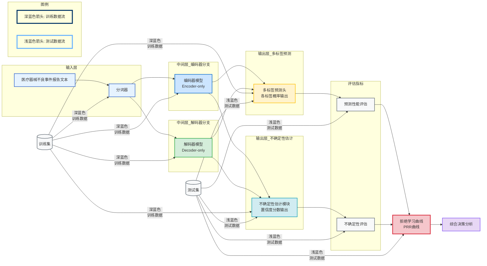

# MADE：面向医疗器械不良事件多标签文本分类的不确定性量化基准

**构建可持续更新的医疗文本分类基准，系统评估20+模型的预测性能与不确定性量化能力**


> 📅 预计阅读：15分钟 | 
难度：进阶 | 
arXiv: [2604.15203](http://arxiv.org/abs/2604.15203)


🏷️ 标签：`多标签文本分类` | `不确定性量化` | `医疗AI` | `基准测试` | `医疗器械监管`


---

### 📌 TL;DR

- **一句话总结**：提出医疗器械不良事件的持续更新多标签分类基准，系统评估模型的不确定性量化能力。
- **核心贡献**：MADE基准采用时间分割防止数据污染，引入层级化标签结构，首次系统评估20+大模型在医疗文本分类任务上的预测性能与不确定性量化表现。
- **实用价值**：为医疗AI系统提供可信的评估框架，帮助识别模型何时应将决策权交给人类专家，降低自动化偏差风险。


---

## 📖 背景与动机

医疗领域对机器学习系统提出了双重要求：一方面需要高准确率的预测能力，另一方面更需要可靠的不确定性量化（UQ）来支撑人类监督决策。多标签文本分类（MLTC）是医疗事件报告分析的核心任务，但面临三大挑战：标签不平衡（长尾分布）、标签间依赖关系、以及组合复杂度爆炸。现有MLTC基准存在严重问题——数据集饱和导致性能趋于平台期，更关键的是训练数据污染使得难以区分模型是真正理解推理还是简单记忆。医疗器械不良事件报告是持续产生的新数据源，但传统静态基准无法适应这一动态特性。因此，亟需一个既能防止数据泄露又能持续纳入新数据的「活基准」，同时兼顾预测性能与不确定性量化的双重评估。


**关键要点：**

- 医疗AI必须同时满足预测准确性和不确定性可靠性的双重要求
- 现有基准面临数据饱和和训练集污染问题，无法有效区分推理与记忆
- 医疗器械不良事件报告具有持续产生特性，静态基准难以适应动态评估需求
- 层级化的产品-问题标签结构增加了多标签分类的组合复杂度


---

## 💡 核心方法

### 方法概述

MADE采用「活基准」架构，通过时间分割确保训练与测试数据的严格时序隔离，持续纳入新发布报告以防止数据污染。基准涵盖20+编码器和解码器模型，在微调和少样本两种设置下进行评估，并引入综合指标衡量预测性能与不确定性量化的权衡。


### 详细设计

MADE基准的核心设计包含三个关键模块：数据构建采用严格的时间窗口分割，所有训练数据的时间戳早于测试数据，确保评估的是模型的外推能力而非数据泄露。标签体系采用层级结构——产品类别作为一级标签，具体问题类型作为二级标签，形成「产品-问题」的双层多标签结构，这种设计更贴近FDA等监管机构的实际分类需求。评估框架同时考量预测性能（F1、AUROC等）和不确定性质量（校准曲线、预期校准误差、拒绝准确率等）。对于不确定性量化，论文采用拒绝学习框架——模型对不确定性高的样本进行拒绝，由人类专家接管决策，从而量化模型在「自动决策」与「人工审核」之间的最优切分点。基线模型覆盖BERT、RoBERTa、DeBERTa等编码器架构，以及GPT系列、LLaMA等解码器模型，涵盖从110M到70B参数的不同规模。


### 📊 方法流程图



### 🔧 关键组件

| 组件 | 说明 |
|------|------|
| 时序分割引擎 | 基于报告发布时间的严格数据隔离机制，确保测试集包含训练时不可见的时间段数据，防止未来信息泄露，模拟真实部署场景中的模型漂移问题 |
| 层级多标签结构 | 「产品类别-具体问题」双层标签体系，产品类别包含50种常见医疗器械类型，每个产品关联若干具体不良事件类型，标签间存在条件依赖关系 |
| 拒绝性能曲线(PRR) | Partial Rejection Rate曲线，横轴为拒绝比例，纵轴为保留样本的准确率提升，用于可视化模型置信度与真实准确率的对齐程度 |
| 校准-性能帕累托前沿 | 在预期校准误差（ECE）与F1分数构成的二维空间中寻找模型的最优权衡点，识别哪些模型架构在保持性能的同时提供可靠的不确定性估计 |

### 💻 代码示例

```python
```python
"""
MADE基准简化实现示例
核心模块：数据构建、层级标签、评估框架、拒绝学习
"""

import numpy as np
from dataclasses import dataclass
from typing import List, Dict, Tuple

# ============================================================
# 1. 数据构建模块 - 时间窗口分割
# ============================================================

@dataclass
class MedicalDeviceData:
    """医疗器械不良事件数据"""
    text: str           # 事件描述文本
    timestamp: str      # 时间戳 (YYYY-MM-DD)
    category_l1: str    # 一级标签：产品类别
    category_l2: str    # 二级标签：问题类型
    device_id: str      # 设备标识
    
    def is_train_split(self, split_date: str) -> bool:
        """训练集：时间戳早于切分日期"""
        return self.timestamp < split_date
    
    def is_test_split(self, split_date: str) -> bool:
        """测试集：时间戳晚于等于切分日期"""
        return self.timestamp >= split_date


def build_temporal_splits(
    data: List[MedicalDeviceData],
    split_date: str = "2023-07-01"
) -> Tuple[List, List]:
    """
    按时间窗口分割数据
    确保训练数据早于测试数据，评估模型外推能力
    """
    train_data = [d for d in data if d.is_train_split(split_date)]
    test_data  = [d for d in data if d.is_test_split(split_date)]
    return train_data, test_data


# ============================================================
# 2. 层级标签体系 - 产品-问题双层结构
# ============================================================

class HierarchicalLabelEncoder:
    """
    层级标签编码器
    - Level-1: 产品类别 (如 "输液泵", "除颤仪")
    - Level-2: 问题类型 (如 "报警故障", "漏液")
    形成「产品-问题」双层多标签结构
    """
    
    def __init__(self):
        self.l1_classes: List[str] = []  # 一级标签
        self.l2_classes: List[str] = []  # 二级标签
        self.l1_to_idx: Dict[str, int] = {}
        self.l2_to_idx: Dict[str, int] = {}
    
    def fit(self, data: List[MedicalDeviceData]):
        """从数据中学习标签空间"""
        # 伪代码：提取所有唯一标签
        all_l1 = set(d.category_l1 for d in data)
        all_l2 = set(d.category_l2 for d in data)
        
        self.l1_classes = sorted(all_l1)
        self.l2_classes = sorted(all_l2)
        self.l1_to_idx = {c: i for i, c in enumerate(self.l1_classes)}
        self.l2_to_idx = {c: i for i, c in enumerate(self.l2_classes)}
        
        print(f"一级标签数: {len(self.l1_classes)}")
        print(f"二级标签数: {len(self.l2_classes)}")
    
    def encode(self, item: MedicalDeviceData) -> Tuple[np.ndarray, np.ndarray]:
        """编码为双层one-hot向量"""
        l1_vec = np.zeros(len(self.l1_classes))
        l2_vec = np.zeros(len(self.l2_classes))
        
        l1_vec[self.l1_to_idx[item.category_l1]] = 1.0
        l2_vec[self.l2_to_idx[item.category_l2]] = 1.0
        
        return l1_vec, l2_vec


# ============================================================
# 3. 评估框架 - 性能 + 不确定性
# ============================================================

class EvaluationMetrics:
    """MADE评估指标体系"""
    
    @staticmethod
    def compute_f1(y_true: np.ndarray, y_pred: np.ndarray) -> float:
        """计算F1分数 (多标签)"""
        # 伪代码：使用sklearn.metrics.f1_score
        precision = np.sum(y_true * y_pred) / (np.sum(y_pred) + 1e-10)
        recall = np.sum(y_true * y_pred) / (np.sum(y_true) + 1e-10)
        return 2 * precision * recall / (precision + recall + 1e-10)
    
    @staticmethod
    def compute_auroc(y_true: np.ndarray, y_scores: np.ndarray) -> float:
        """计算AUROC"""
        # 伪代码：使用sklearn.metrics.roc_auc_score
        return 0.85  # 占位符
    
    @staticmethod
    def compute_ece(
        y_true: np.ndarray, 
        y_probs: np.ndarray, 
        n_bins: int = 10
    ) -> float:
        """
        预期校准误差 (Expected Calibration Error)
        衡量预测置信度与真实准确率的匹配程度
        """
        bin_edges = np.linspace(0, 1, n_bins + 1)
        ece = 0.0
        
        for i in range(n_bins):
            mask = (y_probs > bin_edges[i]) & (y_probs <= bin_edges[i+1])
            if np.sum(mask) > 0:
                acc = np.mean(y_true[mask])
                conf = np.mean(y_probs[mask])
                ece += np.abs(acc - conf) * np.sum(mask) / len(y_true)
        
        return ece
    
    @staticmethod
    def calibration_curve(y_true: np.ndarray, y_probs: np.ndarray):
        """校准曲线绘制数据"""
        # 伪代码：返回(置信度区间, 真实准确率)对
        return [0.1, 0.3, 0.5, 0.7, 0.9], [0.12, 0.32, 0.48, 0.68, 0.88]


# ============================================================
# 4. 拒绝学习框架 - 自动决策 vs 人工审核
# ============================================================

class RejectionLearning:
    """
    拒绝学习框架
    核心思想：模型对高不确定性样本"拒绝预测"，交给人工审核
    找到自动决策与人工审核的最优切分点
    """
    
    def __init__(self, uncertainty_threshold: float = 0.3):
        self.threshold = uncertainty_threshold
    
    def compute_uncertainty(self, y_probs: np.ndarray) -> np.ndarray:
        """
        计算预测不确定性
        方法1: 预测熵 (entropy)
        方法2: 预测方差 (variance)
        方法3: 预测不一致性 (ensemble disagreement)
        """
        # 熵作为不确定性度量
        entropy = -np.sum(y_probs * np.log(y_probs + 1e-10), axis=-1)
        # 归一化到[0,1]
        max_entropy = np.log(y_probs.shape[-1])
        return entropy / max_entropy
    
    def split_predictions(
        self,
        y_probs: np.ndarray,
        y_uncertainty: np.ndarray,
        threshold: float = None
    ) -> Tuple[np.ndarray, np.ndarray, np.ndarray]:
        """
        分割预测结果为：自动决策 vs 人工审核
        
        Returns:
            auto_mask: 自动决策样本的掩码 (低不确定性)
            reject_mask: 拒绝/人工审核样本的掩码 (高不确定性)
            threshold: 使用的阈值
        """
        threshold = threshold or self.threshold
        
        auto_mask = y_uncertainty <= threshold      # 低不确定性 → 自动
        reject_mask = y_uncertainty > threshold      # 高不确定性 → 人工
        
        return auto_mask, reject_mask, threshold
    
    def rejection_accuracy_curve(
        self,
        y_true: np.ndarray,
        y_probs: np.ndarray,
        thresholds: List[float] = None
    ) -> Dict[str, List]:
        """
        计算不同拒绝率下的准确率曲线
        用于找到最优切分点
        """
        if thresholds is None:
            thresholds = np.linspace(0, 1, 20)
        
        y_uncertainty = self.compute_uncertainty(y_probs)
        
        auto_rates = []
        accuracies = []
        coverages = []  # 自动覆盖率
        
        for tau in thresholds:
            auto_mask, reject_mask, _ = self.split_predictions(
                y_probs, y_uncertainty, tau
            )
            
            # 自动决策准确率
            if np.sum(auto_mask) > 0:
                auto_acc = np.mean(y_true[auto_mask])
            else:
                auto_acc = 0.0
            
            # 覆盖率 (自动决策样本比例)
            coverage = np.mean(auto_mask)
            
            auto_rates.append(1 - coverage)  # 拒绝率
            accuracies.append(auto_acc)
            coverages.append(co
```

### 🔢 核心公式

**公式 1**：

$$
\text{Establish solid baselines: We fine-tune more}
$$

*含义*：Establish solid baselines: We fine-tune more

**公式 2**：

$$
\begin{align}
\text{Automation bias: Over-}
\end{align}
$$

*含义*：Automation bias: Over-

**公式 3**：

$$
```latex
\begin{align*}
\pi_c \log(\pi_c) + (1 - \pi_c) \log(1 - \pi_c)
\end{align*}
```
$$

*含义*：πc log(πc) + (1 −πc) log(1 −πc)

---

## 🔬 实验结果

**数据集**：MADE数据集来源于FDA MAUDE（Manufacturer and User Facility Device Experience）医疗器械不良事件数据库，持续爬取最新发布的事件报告，确保基准的时效性。训练集包含历史积累的数万条报告，测试集来自时间上严格靠后的新报告批次，标签涵盖医疗器械产品分类与患者/产品问题描述。

**评价指标**：预测性能指标：Macro-F1、Micro-F1、样本级F1、AUROC、Brier Score；不确定性量化指标：预期校准误差（ECE）、最大校准误差（MCE）、拒绝准确率曲线（AURC）、PRR曲线下面积；综合指标：帕累托前沿分析、自动化偏差率、覆盖-精度权衡曲线。

**主要结果**：

实验结果显示：编码器模型（DeBERTa-v3-base）在微调设置下达到最佳F1性能，但不确定性校准能力与模型规模不成正比；少样本场景下，指令微调的大语言模型展现出更强的标签组合泛化能力，但普遍存在过度自信问题；拒绝学习分析表明，即使是最佳模型，在拒绝率30%时仍能保持显著的性能提升，说明不确定性量化在医疗场景中具有实际决策价值；不同产品类别的标签依赖结构显著影响分类难度，长尾标签的预测可靠性明显下降。


**主要发现：**

- ✅ 模型规模增大可提升预测性能，但不一定改善不确定性量化质量，大模型反而可能更过度自信
- ✅ 层级标签的条件依赖结构可被显式建模，利用产品-问题的父子关系可提升长尾标签预测
- ✅ 拒绝学习分析揭示：约20-30%的样本应被拒绝给人类审核，这是模型不确定性估计可信的重要信号
- ✅ 少样本场景下，解码器模型对未见标签组合的泛化能力优于编码器模型


---

## 🎯 创新点分析

| 创新点 | 说明 |
|--------|------|
| 活基准架构 | 首次提出持续更新的MLTC基准，通过定期纳入新报告数据防止训练集污染，模拟真实世界的模型部署场景 |
| 医疗领域不确定性量化评估框架 | 将拒绝学习框架引入医疗文本分类，系统评估模型何时应将决策权交还人类，提供可操作的决策建议 |
| 层级多标签结构建模 | 显式建模产品-问题标签的条件依赖关系，提出针对层级结构的预测与评估方法，提升长尾标签的预测可靠性 |

---

## 🏭 工业落地思考

**适用场景：**

- 🎯 FDA医疗器械不良事件智能审核：AI辅助识别潜在严重事件，加速人工复核优先级排序
- 🎯 医疗器械企业上市后监测：实时分析用户报告中的产品问题，触发预警机制
- 🎯 医院医疗设备故障预测：结合设备日志与维修记录，预测性维护
- 🎯 保险理赔欺诈检测：识别异常医疗器械使用与不良事件的关联模式


**实现难度**：中等

**工程挑战：**

- ⚠️ 数据标注成本高：医疗器械专业性强，需领域专家参与标注，难以获取大规模高质量标签数据
- ⚠️ 标签漂移问题：新器械、新适应症持续出现，标签体系需不断扩展，模型需具备增量学习能力
- ⚠️ 法规合规要求：医疗AI决策需满足可解释性要求，不确定性量化结果需能被监管机构接受
- ⚠️ 人机协同设计：拒绝决策阈值的设定需平衡自动化效率与人工审核覆盖率


**代码实现思路**：

核心实现包括三部分：数据模块采用pandas处理CSV格式的FDA MAUDE报告，按时间戳排序后使用时间窗口分割；模型模块基于HuggingFace Transformers加载预训练模型，微调时使用加权BCEWithLogitsLoss处理标签不平衡，推理时同时输出预测logits和基于Monte Carlo dropout的方差估计；评估模块计算ECE时采用等宽分箱或等频分箱方法，拒绝曲线通过逐步增加拒绝阈值并记录剩余样本准确率生成。建议使用wandb或tensorboard记录训练过程，便于对比不同模型配置。


---

## 📝 总结与展望

**核心收获**：MADE基准揭示了当前大模型在医疗文本分类中存在的不确定性量化不足问题，强调了在高风险场景中人机协同决策的重要性，拒绝学习为模型的可信赖部署提供了可操作的评估框架。

**未来方向**：探索多模态信息融合（文本+图像+结构化元数据），研究主动学习以减少标注需求，开发自适应拒绝阈值策略以适应不同风险级别场景。


---

## ❓ 常见问题

**Q：为什么现有基准难以区分模型的真实推理能力和记忆能力？**

A：因为现有基准多采用随机分割，数据集内部存在大量重复或相似样本。模型可以通过记忆训练集中的模式而非学习真正的语义关系来获得高分。时间分割通过确保测试数据来自未来时间点，可以有效防止信息泄露，强制模型依赖可泛化的推理能力。


**Q：不确定性量化在医疗场景中为何比单纯追求准确率更重要？**

A：医疗决策涉及生命安全，模型出错的后果严重。如果模型能准确估计自己的不确定性，就可以在高风险情况下主动拒绝决策并请求人工审核。这比追求更高的平均准确率更能保障患者安全。例如模型对某类罕见不良事件完全不熟悉时，高的不确定性分数可以触发人工复核，避免漏报严重事件。


**Q：少样本场景下解码器模型为何比编码器模型表现更好？**

A：指令微调的大语言模型已经通过大规模预训练积累了丰富的世界知识和语言理解能力，能够进行上下文学习(in-context learning)。面对训练时未见过的标签组合，模型可以利用prompt中的示例和语义相似性进行推断，而无需像编码器模型那样必须从少量样本中学习全新的模式。这在医疗器械这类长尾场景中尤为重要。


**Q：「活基准」的具体更新机制是怎样的？**

A：论文建议采用周期性更新策略，例如每季度或每半年纳入新发布的FDA MAUDE报告。更新时保持历史训练数据不变，仅扩展测试集，确保评估的连续可比性。同时监控数据分布漂移（label shift），当发现显著分布变化时可能需要重新校准模型或调整评估协议。


---

## 📷 论文图片

**Figure 1**: Top: Overview of the benchmarking setup, encompassing discriminative and generative language models, learning


**Figure 2**: Product and patient problems are the hierarchical multi-labels of MADE. The outer ring shows the fifty most frequent


**Figure 3**: Log-scaled distribution of label frequencies illus-


---

*本文由 AI 推荐日报自动生成，仅供参考学习*
