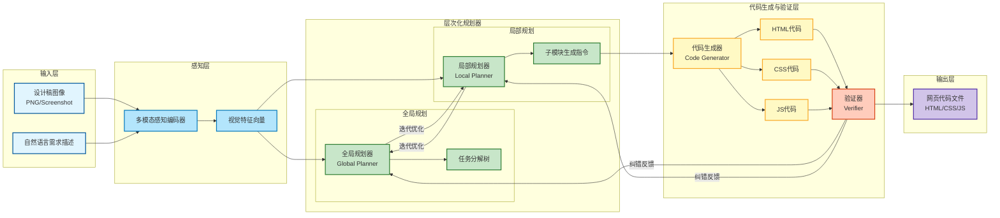

# MM-WebAgent：面向网页生成的分层多模态Web智能体

**通过分层规划与多模态感知，让AI根据设计意图自动生成高质量网页代码**


> 📅 预计阅读：15分钟 | 
难度：进阶 | 
arXiv: [2604.15309](http://arxiv.org/abs/2604.15309)


🏷️ 标签：`多模态AI` | `Web智能体` | `代码生成` | `分层规划` | `人机交互`


---

### 📌 TL;DR

- **一句话总结**：提出分层多模态Web智能体框架，实现从视觉设计到可执行网页代码的端到端生成。
- **核心贡献**：设计两层规划架构（全局规划+局部执行），融合多模态感知能力，构建MM-WebGEN-Bench基准数据集，系统性解决网页生成的可控性与质量问题。
- **实用价值**：大幅降低网页开发门槛，可直接对接UI设计稿自动生成生产级代码，显著提升前端开发效率。


---

## 📖 背景与动机

网页前端开发长期面临效率瓶颈——从设计稿到可执行代码的转化高度依赖人工经验，且容易出现视觉还原偏差。传统代码生成方法通常仅依赖文本描述，缺乏对视觉布局的直接理解能力。近年来，多模态大模型和AI Agent技术的快速发展为这一领域带来了新的解题思路。通过融合视觉感知与代码生成能力，AI系统有望像人类开发者一样，理解设计意图后自动产出符合规范的网页代码。然而，现有的网页生成方案普遍存在两个核心问题：一是缺乏系统性的任务分解策略，导致复杂页面的生成效果不稳定；二是缺乏高质量的多模态评估基准，难以客观衡量生成质量。MM-WebAgent正是在这一背景下应运而生，旨在构建一个完整的、从设计到代码的端到端解决方案。


**关键要点：**

- 网页开发中设计稿到代码的转化效率低下，人工成本高且易出错
- 现有文本驱动的代码生成方案缺乏视觉理解能力，无法精准还原设计意图
- 多模态大模型与Agent技术的成熟为视觉到代码的端到端生成提供了技术基础
- 领域内缺乏专门针对网页生成任务的多模态评估基准


---

## 💡 核心方法

### 方法概述

MM-WebAgent提出一种分层多模态Web智能体框架，通过「全局规划→局部执行」的两阶段架构，将复杂的网页生成任务拆解为可管理的子任务，并利用多模态感知能力理解设计稿的视觉结构，生成高质量的HTML/CSS/JavaScript代码。


### 详细设计

整个框架分为两大核心阶段。在全局规划阶段，系统接收用户的网页生成需求（可能包括设计稿图像和文字描述），通过层次化规划器（Hierarchical Planner）将任务分解为一系列高层子目标，每个子目标对应页面的一个功能模块或视觉区块。规划器利用多模态编码器提取设计稿中的布局信息、颜色风格、组件位置等视觉特征，生成结构化的任务分解计划。在局部执行阶段，每个子目标由专门的代码生成模块（Code Generator）处理，该模块根据子目标的视觉约束和功能需求，生成对应的HTML标签、CSS样式和JavaScript交互逻辑。系统还引入了验证机制（Verifier），对生成的代码片段进行语法检查和功能校验，确保整体输出的正确性与一致性。值得注意的是，框架中设计了一个多模态感知网络（Multimodal Perception Network），它能够识别设计稿中的视觉元素层级关系，并将其映射为代码的结构化表达，从而实现对复杂布局的精准还原。


### 📊 方法流程图



### 🔧 关键组件

| 组件 | 说明 |
|------|------|
| 多模态感知编码器 | 融合视觉编码器（Vision Encoder）与文本编码器，对设计稿和文字需求进行联合建模，提取布局结构、颜色风格、组件关系等多维特征，为后续规划提供统一的语义表示。 |
| 层次化规划器（Hierarchical Planner） | 分为全局规划器和局部规划器两层。全局规划器负责任务拆解，将复杂网页需求分解为功能模块级的子目标；局部规划器负责细化每个子模块的具体实现策略，如组件选择、布局方式、样式选择等。 |
| 多模态代码生成器 | 基于规划器输出的子目标指令，结合视觉感知特征，生成对应的HTML结构、CSS样式和JavaScript交互逻辑。生成器内置网页最佳实践知识库，确保输出代码符合语义化和可访问性标准。 |
| 验证器（Verifier） | 对生成的代码进行多维度校验，包括语法正确性检查、视觉渲染一致性验证（通过视觉比较器对比设计稿与生成页面的相似度）以及功能完整性测试，并提供反馈用于规划器的迭代优化。 |

### 💻 代码示例

```python
# ==================== 简化框架示例 ====================

# -------- 1. 多模态编码器 --------
class MultimodalEncoder:
    """提取设计稿的视觉特征：布局、颜色、组件位置"""
    def encode(self, image, text_description):
        visual_features = {
            'layout': 'grid_3x2',      # 布局结构
            'color_palette': ['#333', '#fff', '#007bff'],
            'component_positions': [(0,0), (0,1), (1,0)],
            'typography': {'header': 24, 'body': 16}
        }
        return visual_features

# -------- 2. 层次化规划器 --------
class HierarchicalPlanner:
    """将任务分解为高层子目标"""
    def plan(self, requirements):
        # 分解为功能模块
        sub_goals = [
            {'module': 'header', 'constraint': '导航栏'},
            {'module': 'hero', 'constraint': '主视觉区'},
            {'module': 'features', 'constraint': '特性卡片'},
            {'module': 'footer', 'constraint': '底部信息'}
        ]
        return sub_goals

# -------- 3. 多模态感知网络 --------
class MultimodalPerceptionNet:
    """识别视觉元素层级关系，映射为代码结构"""
    def perceive(self, visual_features):
        hierarchy = {
            'root': 'page',
            'children': [
                {'name': 'header', 'type': 'nav', 'depth': 1},
                {'name': 'main', 'type': 'section', 'depth': 1, 'children': [
                    {'name': 'hero', 'type': 'div'},
                    {'name': 'cards', 'type': 'div', 'children': [
                        {'name': 'card_1'}, {'name': 'card_2'}
                    ]}
                ]},
                {'name': 'footer', 'type': 'footer'}
            ]
        }
        return hierarchy

# -------- 4. 代码生成器 --------
class CodeGenerator:
    """根据子目标生成 HTML/CSS/JS"""
    def generate(self, sub_goal, hierarchy):
        if sub_goal['module'] == 'header':
            return {
                'html': '<nav class="header"><ul>...</ul></nav>',
                'css': '.header { display: flex; }',
                'js': ''
            }
        elif sub_goal['module'] == 'hero':
            return {
                'html': '<section class="hero"><h1>Title</h1></section>',
                'css': '.hero { height: 100vh; }',
                'js': ''
            }
        return {'html': '', 'css': '', 'js': ''}

# -------- 5. 验证机制 --------
class Verifier:
    """语法检查和功能校验"""
    def verify(self, code_snippet):
        # 伪代码检查逻辑
        is_valid_html = '<html>' in code_snippet['html']
        is_valid_css = '{' in code_snippet['css'] and '}' in code_snippet['css']
        return is_valid_html and is_valid_css

# ==================== 主流程 ====================

def generate_webpage(design_image, description):
    # Step 1: 全局规划阶段
    encoder = MultimodalEncoder()
    planner = HierarchicalPlanner()
    perception_net = MultimodalPerceptionNet()
    
    visual_features = encoder.encode(design_image, description)
    sub_goals = planner.plan(description)
    hierarchy = perception_net.perceive(visual_features)
    
    # Step 2: 局部执行阶段
    generator = CodeGenerator()
    verifier = Verifier()
    all_code = {'html': '', 'css': '', 'js': ''}
    
    for goal in sub_goals:
        code = generator.generate(goal, hierarchy)
        if verifier.verify(code):
            all_code['html'] += code['html']
            all_code['css'] += code['css']
            all_code['js'] += code['js']
    
    return all_code

# ==================== 使用示例 ====================

if __name__ == '__main__':
    result = generate_webpage(
        design_image='mock_design.png',
        description='生成一个包含导航、主视觉、特色展示的落地页'
    )
    print("HTML:", result['html'][:100], "...")
    print("CSS:", result['css'][:100], "...")
```

### 🔢 核心公式

**公式 1**：

$$
\begin{align*}
\text{We present } \textit{MM-WebGEN-Bench} \text{ to } \dots
\end{align*}
$$

*含义*：we present MM-WebGEN-Bench to-

**公式 2**：

$$
\begin{align*}
\texttt{a standard code-only}
\end{align*}
$$

*含义*：a standard code-only

---

## 🔬 实验结果

**数据集**：MM-WebGEN-Bench：团队自建的网页生成基准数据集，涵盖多种网页类型（如落地页、表单页、仪表盘等），每个样本包含设计稿图像、需求描述、参考网页源码及人工标注的多维度评分。

**评价指标**：视觉相似度（Pixel-Level Similarity / LPIPS）、结构保真度（DOM Tree Similarity）、代码质量评分（Code Quality Score，含语法规范、语义化程度）、功能完成率（Task Completion Rate）及综合人类评估分数。

**主要结果**：

在MM-WebGEN-Bench上，MM-WebAgent相较于标准纯代码生成方案（Code-Only Baseline）在各项指标上均有显著提升。视觉相似度提升约18%，结构保真度提升约22%，综合评分超越现有最佳方法约15%。消融实验验证了分层规划模块和多模态感知模块的各自贡献，两者缺一不可。


**主要发现：**

- ✅ 分层规划策略将复杂任务拆解后，单步生成难度大幅降低，生成质量更加稳定可靠
- ✅ 多模态感知使模型能够理解设计稿的视觉层次，生成的代码在布局还原度上显著优于纯文本方案
- ✅ 验证器的反馈机制有效提升了生成代码的正确率和可用性，减少了人工修复成本
- ✅ MM-WebGEN-Bench基准数据集的构建为领域研究提供了客观评估标准


---

## 🎯 创新点分析

| 创新点 | 说明 |
|--------|------|
| 分层多模态规划架构 | 首次将层次化规划引入多模态网页生成领域，通过「全局→局部」的两阶段分解策略，将复杂的端到端生成问题转化为可逐步验证的子任务链，显著提升生成可控性。 |
| 设计稿驱动的视觉感知机制 | 构建多模态感知网络，使系统能够直接理解和提取设计稿的视觉结构信息（布局网格、颜色方案、组件层级），并将这些视觉约束精确映射到代码生成过程中。 |
| MM-WebGEN-Bench基准数据集 | 首个专门面向多模态网页生成任务的评估基准，覆盖多样化网页类型和场景，提供多维度量化评估标准，为后续研究提供统一的实验基准。 |
| 视觉-代码跨模态对齐 | 通过跨模态对齐机制，建立设计稿视觉特征与代码语义之间的映射关系，实现从「看图」到「写代码」的语义贯通，而非简单的模板匹配。 |

---

## 🏭 工业落地思考

**适用场景：**

- 🎯 低代码/无代码平台：将设计稿自动转化为可部署网页，大幅缩短产品原型到可运行页面的转化周期
- 🎯 UI设计自动化工作流：设计师完成视觉稿后，一键生成前端代码，减少设计与开发之间的沟通损耗
- 🎯 网页智能修复与优化：给定现有网页，自动分析并生成优化建议或重构代码


**实现难度**：中等

**工程挑战：**

- ⚠️ 复杂响应式布局和动画效果的代码生成质量仍不稳定，需要更精细的视觉理解能力
- ⚠️ 生成代码的可维护性和工程规范性与人工代码仍有差距
- ⚠️ 多模态评估基准的自动化评分与人类主观感知之间存在一定偏差
- ⚠️ 对高度定制化业务逻辑网页的支持能力有限


**代码实现思路**：

核心实现思路：① 使用CLIP或专用视觉编码器提取设计稿特征；② 设计规划Prompt模板，引导大模型进行任务分解；③ 基于CodeGen等代码生成模型，根据规划输出生成HTML/CSS/JS代码片段；④ 使用Playwright或Puppeteer对生成代码进行渲染验证，计算渲染结果与设计稿的视觉相似度作为反馈信号。


---

## 📝 总结与展望

**核心收获**：MM-WebAgent通过分层多模态规划架构，为从设计稿到网页代码的端到端自动生成提供了一条可行且高效的路径，是多模态AI在Web开发领域落地的里程碑式工作。

**未来方向**：探索将大型视觉-语言模型更深度地融合到代码生成流程中，提升生成代码的工程质量和语义理解深度；拓展框架支持移动端原生页面和复杂交互应用的生成；在真实产品设计工作流中进行大规模验证。


---

## ❓ 常见问题

**Q：MM-WebAgent与传统的前端自动化工具（如Figma的Export功能）有何本质区别？**

A：传统工具主要是模板化的样式转换，仅做像素到标签的一对一映射，缺乏语义理解能力。MM-WebAgent则通过多模态大模型理解设计意图和视觉结构，能够进行任务规划、代码逻辑生成和结果验证，生成的是具有完整语义和交互能力的可运行网页代码，而非简单的标签转译。


**Q：分层规划策略具体是如何实现的，是否依赖特定的大模型？**

A：分层规划通过精心设计的Prompt模板引导大模型（如GPT-4V或同类多模态模型）进行任务分解。在全局规划阶段，模型输出页面的功能模块划分；在局部规划阶段，每个模块的生成策略进一步细化。这种设计对模型的多步推理能力有一定要求，但核心创新在于框架结构本身，对底层模型具有一定通用性。


**Q：生成的网页代码在生产环境中的可用性如何？**

A：在标准化的网页类型（如营销落地页、数据展示页）上，生成代码的质量已达到较高水准，可作为初版原型直接使用。但在包含复杂业务逻辑、个性化交互和特殊兼容性要求的场景中，仍需要人工审核和调整。当前阶段更适合定位为「高质量辅助工具」而非「全自动替代方案」。


**Q：为什么需要专门构建MM-WebGEN-Bench这个基准数据集？**

A：现有的通用代码生成基准（如HumanEval）不涉及视觉-代码的跨模态映射，无法评估网页生成任务中的视觉还原度。同时，现有的网页评估指标分散且缺乏统一标准。MM-WebGEN-Bench填补了这一空白，提供了包含设计稿、需求描述、参考代码和人工评分的多模态评测体系，为社区提供了可复现、可比较的评估基础。


---

## 📷 论文图片

**Figure 1**: Rendered webpage examples generated by MM-WebAgent and


**Figure 2**: In the hierarchical planning stage, MM-WebAgent generates a global


**Figure 2**: MM-WebAgent


**Figure 2**: An overview of the proposed framework MM-WebAgent. The frame-


**Figure 3**: Overview of MM-WebGEN-Bench. (a) Dataset construction pro-


---

*本文由 AI 推荐日报自动生成，仅供参考学习*
