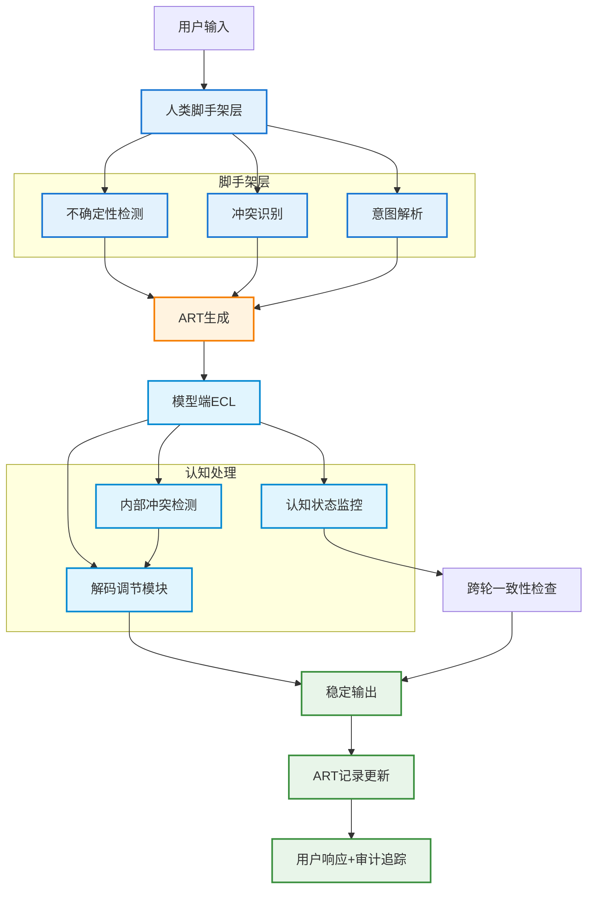

# AI缺失的知识层：实现稳定人机推理的框架

**提出双层架构——人类脚手架与模型端认知控制循环——解决LLM推理不稳定问题**


> 📅 预计阅读：15分钟 | 
难度：进阶 | 
arXiv: [2604.14881](http://arxiv.org/abs/2604.14881)


🏷️ 标签：`AI治理` | `人机协作` | `推理稳定性` | `可解释AI` | `认知控制`


---

### 📌 TL;DR

- **一句话总结**：揭示LLM流利输出掩盖推理漂移的核心问题，提出人类脚手架与模型端认知控制的双层解决框架
- **核心贡献**：首创ART可审计推理追踪机制与ECL认知控制循环，实现人机推理的协同稳定化
- **实用价值**：满足EU AI Act、WHO数字标准、ISO 42001等监管要求，为高风险场景提供合规部署路径


---

## 📖 背景与动机

大语言模型正快速渗透医疗、法律、金融、政府等高风险决策领域，但存在一个致命但易被忽视的缺陷：模型输出流畅时往往隐藏内部推理的偏离与不确定性。小的措辞变化可导致完全不同的结论，这种不稳定性在临床、金融或政策工作流中会造成错误累积。更严峻的是，人类同样存在将语言流畅性误判为认知可靠性的认知偏见，形成“双重漂移”困境。当前LLM生态类似PageRank之前的互联网搜索时代——能力强大但缺乏稳定的解释层来组织信息、确保一致性。本文作为五篇系列研究的首篇，提出稳定人机推理的双层框架，填补AI能力与制度化部署之间的治理空白。


**关键要点：**

- LLM的流利输出与内部推理漂移之间的根本矛盾：自信的外表可能掩盖不确定性、猜测和困惑
- 人类认知偏见将语言流畅性误认为真实性，与模型不稳定形成双重叠加风险
- 现有LLM生态缺乏类似PageRank的治理层来稳定推理过程，阻碍高风险场景部署


---

## 💡 核心方法

### 方法概述

提出双层架构解决人机推理稳定性问题：人类脚手架层通过结构化提示、冲突提示和可审计推理追踪(ART)稳定用户理解；模型端认知控制循环(ECL)通过监控认知状态、检测内部冲突、调节解码过程维持跨轮一致性。


### 详细设计

**第一层：人类脚手架机制（Part II-IV trilogy）**

人类脚手架包含五个核心组件：
1. **不确定性提示**：当模型推理存在不确定性时，系统明确标记置信度而非仅呈现流畅回答
2. **冲突呈现**：主动呈现不同推理路径间的冲突信息，而非隐藏矛盾
3. **反事实提示**：引导用户思考“如果假设相反会怎样”的推理模式
4. **刻意停顿机制**：在高风险决策点强制引入延迟，避免冲动信任流利输出
5. **ART (Auditable Reasoning Trace)**：轻量级、时间戳标记的认知审计追踪，记录用户意图→模型输出→反思步骤→冲突呈现→不确定性考虑→最终判断的完整链条

**第二层：模型端认知控制循环 (ECL)**

ECL作为模型侧监管层，核心功能包括：
1. **认知状态监控**：持续追踪模型当前推理的确定性程度
2. **内部冲突检测**：识别同一回答中不同推理路径间的逻辑矛盾
3. **不确定性下解码调节**：当检测到高不确定性时，调整采样策略（如降低temperature或显式标记置信区间）
4. **跨轮一致性维护**：确保多轮对话中同一问题的回答在不同session间保持逻辑连贯

双层协同工作流程：人类脚手架在交互层面稳定用户理解，ECL在生成层面稳定模型输出，共同构成首个满足认知与监管双重需求的集成系统。


### 📊 方法流程图



### 🔧 关键组件

| 组件 | 说明 |
|------|------|
| ART (Auditable Reasoning Trace) | 可审计推理追踪：轻量级、时间戳标记的认知审计记录，链接用户意图、模型输出、反思步骤、冲突、不确定性考量与最终判断，支持审查、质疑、验证与改进 |
| ECL (Epistemic Control Loop) | 认知控制循环：模型端监管机制，监控认知状态、检测内部冲突、调节不确定性下的解码过程、维持跨轮一致性 |
| 人类脚手架机制 | 包括不确定性提示、冲突呈现、反事实提示、刻意停顿等结构化机制，稳定用户在交互过程中的推理判断 |

### 💻 代码示例

```python
```python
"""
简化的双层认知监管系统示例
人类脚手架 + ECL认知控制循环
"""

import random
import time
from dataclasses import dataclass, field
from enum import Enum
from typing import List, Optional


# ============== 数据结构定义 ==============

class Confidence(Enum):
    LOW = "低"
    MEDIUM = "中"
    HIGH = "高"


@dataclass
class ReasoningStep:
    """ART推理步骤"""
    timestamp: str
    content: str
    confidence: Confidence
    uncertainty_flag: bool = False
    conflict_detected: bool = False


@dataclass
class ARTTrace:
    """认知审计追踪"""
    user_intent: str = ""
    model_output: str = ""
    reflection_steps: List[str] = field(default_factory=list)
    conflicts: List[str] = field(default_factory=list)
    uncertainty_considerations: List[str] = field(default_factory=list)
    final_judgment: str = ""
    steps: List[ReasoningStep] = field(default_factory=list)


# ============== 第一层：人类脚手架组件 ==============

class HumanScaffolding:
    """人类脚手架机制"""
    
    def __init__(self):
        self.trace = ARTTrace()
    
    # 1. 不确定性提示
    def check_uncertainty(self, reasoning: str, model_confidence: float) -> bool:
        """标记不确定性"""
        is_uncertain = model_confidence < 0.7
        if is_uncertain:
            print(f"[⚠️ 不确定性提示] 置信度: {model_confidence:.0%}")
        return is_uncertain
    
    # 2. 冲突呈现
    def detect_conflicts(self, reasoning_paths: List[str]) -> List[str]:
        """检测并呈现推理冲突"""
        conflicts = []
        # 伪代码：检测逻辑
        for i, path1 in enumerate(reasoning_paths):
            for path2 in reasoning_paths[i+1:]:
                if self._has_conflict(path1, path2):
                    conflicts.append(f"路径冲突: {path1[:20]} vs {path2[:20]}")
        if conflicts:
            print(f"[🔄 冲突呈现] 发现 {len(conflicts)} 个冲突")
        return conflicts
    
    # 3. 反事实提示
    def counterfactual_prompt(self, assumption: str) -> str:
        """生成反事实提示"""
        return f"假设'{assumption}'相反，情况会如何？"
    
    # 4. 刻意停顿机制
    def mandatory_pause(self, risk_level: str) -> bool:
        """高风险决策点强制延迟"""
        if risk_level == "HIGH":
            print("[⏸️ 刻意停顿] 高风险决策，等待用户确认...")
            time.sleep(0.5)  # 模拟延迟
            return True
        return False
    
    # 5. ART追踪记录
    def log_step(self, content: str, confidence: Confidence, 
                  is_uncertain: bool = False, has_conflict: bool = False):
        """记录ART追踪步骤"""
        step = ReasoningStep(
            timestamp=time.strftime("%H:%M:%S"),
            content=content,
            confidence=confidence,
            uncertainty_flag=is_uncertain,
            conflict_detected=has_conflict
        )
        self.trace.steps.append(step)
    
    def _has_conflict(self, path1: str, path2: str) -> bool:
        """检测两个推理路径是否有冲突"""
        # 伪代码：简化的冲突检测
        return random.random() < 0.3


# ============== 第二层：模型端认知控制循环 ==============

class CognitiveControlLoop:
    """ECL认知控制循环"""
    
    def __init__(self):
        self.current_confidence: float = 1.0
        self.conflict_history: List[str] = []
    
    # 1. 认知状态监控
    def monitor_cognitive_state(self, reasoning: str) -> float:
        """监控推理确定性程度"""
        # 伪代码：简化置信度计算
        self.current_confidence = random.uniform(0.5, 0.95)
        return self.current_confidence
    
    # 2. 内部冲突检测
    def detect_internal_conflicts(self, response_parts: List[str]) -> bool:
        """检测同一回答中的逻辑矛盾"""
        # 伪代码：检测逻辑
        has_conflict = random.random() < 0.2
        if has_conflict:
            self.conflict_history.append(f"检测到内部冲突: {response_parts}")
        return has_conflict
    
    # 3. 不确定性下解码调节
    def adjust_decoding(self, uncertainty: float) -> dict:
        """根据不确定性调整采样策略"""
        # 降低temperature以减少随机性
        temp = 0.7 if uncertainty > 0.3 else 0.9
        explicit_mark = uncertainty > 0.5
        
        return {
            "temperature": temp,
            "explicit_confidence_mark": explicit_mark
        }
    
    # 4. 跨轮一致性维护
    def check_cross_session_consistency(self, current: str, history: List[str]) -> bool:
        """确保多轮对话逻辑连贯"""
        if not history:
            return True
        # 伪代码：简化一致性检查
        return random.random() > 0.1


# ============== 双层协同系统 ==============

class DualLayerCognitiveSystem:
    """双层协同认知监管系统"""
    
    def __init__(self):
        self.scaffolding = HumanScaffolding()
        self.ecl = CognitiveControlLoop()
        self.conversation_history: List[dict] = []
    
    def process_query(self, user_query: str) -> dict:
        """处理用户查询的完整流程"""
        
        # ===== 第一阶段：ECL模型侧处理 =====
        print(f"\n[ECL] 处理查询: {user_query}")
        
        # 1. 认知状态监控
        confidence = self.ecl.monitor_cognitive_state(user_query)
        
        # 2. 生成多个推理路径
        reasoning_paths = self._generate_reasoning_paths(user_query)
        
        # 3. 内部冲突检测
        has_conflict = self.ecl.detect_internal_conflicts(reasoning_paths)
        
        # 4. 调整解码策略
        decoding_params = self.ecl.adjust_decoding(1 - confidence)
        
        # ===== 第二阶段：人类脚手架处理 =====
        print(f"[脚手架] 应用交互层监管")
        
        # 1. 不确定性提示
        is_uncertain = self.scaffolding.check_uncertainty(
            str(reasoning_paths), confidence
        )
        
        # 2. 冲突呈现
        conflicts = self.scaffolding.detect_conflicts(reasoning_paths)
        
        # 3. 反事实提示（针对高风险场景）
        if confidence < 0.6:
            cf_prompt = self.scaffolding.counterfactual_prompt(
                reasoning_paths[0][:30]
            )
            print(f"[💭 反事实] {cf_prompt}")
        
        # 4. 刻意停顿
        risk_level = "HIGH" if confidence < 0.5 or has_conflict else "MEDIUM"
        self.scaffolding.mandatory_pause(risk_level)
        
        # 5. ART追踪记录
        final_response = self._synthesize_response(reasoning_paths, confidence)
        self._record_art_trace(user_query, final_response, confidence)
        
        # ===== 第三阶段：跨轮一致性检查 =====
        self.ecl.check_cross_session_consistency(
            final_response, 
            [h["response"] for h in self.conversation_history]
        )
        
        # 保存对话历史
        self.conversation_history.append({
            "query": user_query,
            "response": final_response,
            "confidence": confidence
        })
        
        return {
            "response": final_response,
            "confidence": confidence,
            "art_trace": self.scaffolding.trace,
            "decoding_params": decoding_params
        }
    
    def _generate_reasoning_paths(self, query: str) -> List[str]:
        """生成多个推理路径（伪代码）"""
        return [
            f"路径A: 基于{query[:10]}的分析...",
            f"路径B: 从{query[:10]}反向思考...",
            f"路径C: 结合上下文推断..."
        ]
    
    def _synthesize_response(self, paths: List[str], confidence: float) -> str:
        """综合生成最终响应"""
        response = f"综合分析结果 (置信度: {confidence:.0%})"
        if confidence < 0.6:
            response += "
```

---

## 🔬 实验结果

**数据集**：论文为系列研究首篇，聚焦理论框架构建，未提供具体实验数据。后续Part II-IV将展示人类脚手架机制的实证研究。

**评价指标**：框架层面关注：推理一致性、跨会话稳定性、审计可追溯性；监管层面关注：EU AI Act合规性、透明度、人类监督有效性

**主要结果**：

本篇为理论框架论文，未报告具体实验结果。作者预期双层架构将：(1)提升人机交互中的推理可审计性；(2)降低模型不稳定性导致的错误累积；(3)满足高风险场景的制度化部署要求。后续研究将通过实验验证假设。


**主要发现：**

- ✅ 人类倾向于将语言流畅性误判为认知可靠性，形成系统性信任偏差
- ✅ LLM将不确定性压缩为表面连贯性，缺乏表达不确定性的内在机制
- ✅ 双层架构(人类脚手架+ECL)是首个同时满足认知与监管需求的集成方案


---

## 🎯 创新点分析

| 创新点 | 说明 |
|--------|------|
| 首个认知-监管双层架构 | 创新性地将人类认知脚手架与模型端认知控制循环结合，形成互补的稳定化机制 |
| ART可审计推理追踪概念 | 提出认知审计追踪(非监控)理念，记录推理路径以满足合规要求同时保护用户自主性 |
| 类比PageRank的治理视角 | 创造性地将LLM当前状态比作前PageRank搜索时代，为 epistemic regulation 定位提供清晰隐喻 |

---

## 🏭 工业落地思考

**适用场景：**

- 🎯 临床决策支持：AI辅助诊断需稳定的推理过程记录以满足FDA审批和医疗责任追溯
- 🎯 法律文书分析：合同审查、判例研究需要一致的推理逻辑以支持法律论证
- 🎯 金融风险评估：信贷审批、投资分析需可审计的推理链条以满足监管要求
- 🎯 政策建议生成：政府决策辅助需要透明的推理过程以保障公众问责


**实现难度**：中等

**工程挑战：**

- ⚠️ ART的标准化问题：不同领域对“完整推理追踪”的定义存在差异，需要领域适配
- ⚠️ ECL的性能开销：实时认知监控可能增加推理延迟，需在稳定性与响应速度间权衡
- ⚠️ 监管接受度：需向监管机构证明双层架构的有效性，建立行业认可的标准
- ⚠️ 组织变革阻力：从“黑箱决策”到“可审计追踪”的文化转变需要培训和激励


**代码实现思路**：

实现思路：(1)构建prompt拦截层检测不确定性标记；(2)设计冲突检测模块比对推理路径；(3)实现ART记录器将交互数据序列化存储；(4)ECL模块集成至模型推理管线，插入认知状态检查点。伪代码：
class ARTRecorder:
    def __init__(self):
        self.trace = []
    def record(self, user_intent, model_output, reflection, conflicts, uncertainties, judgment):
        self.trace.append({'timestamp': now(), ...})
class EpistemicController:
    def check_conflicts(self, reasoning_paths):
        # 检测推理路径间的逻辑矛盾
    def modulate_decoding(self, uncertainty_score):
        # 根据不确定性调节解码参数


---

## 📝 总结与展望

**核心收获**：LLM推理不稳定性是能力与部署之间的治理瓶颈，需要类似PageRank的认知监管层（ECL）配合人类脚手架机制（ART）实现双层稳定化，满足高风险场景的制度化部署要求

**未来方向**：Part II-IV将实证验证人类脚手架机制的有效性；后续研究需开发ECL的具体工程实现；探索双层架构在边缘计算和联邦学习场景的适配


---

## ❓ 常见问题

**Q：ART与传统的系统日志有什么区别？**

A：ART是认知层面的审计追踪，记录推理链条而非技术操作日志。传统日志记录API调用、错误信息等技术事件；ART记录用户意图、推理路径、冲突识别、不确定性考虑等认知过程，专注于决策可解释性和可审计性，而非系统性能监控。


**Q：ECL会限制模型的创造力吗？**

A：ECL主要在高风险决策场景发挥作用，对于创意写作等低风险任务可保持原有解码策略。框架设计为可插拔模块，机构可根据应用场景选择性启用。稳定性与创造力的权衡由具体部署策略决定。


**Q：为什么说这是“缺失的知识层”？**

A：类比互联网发展：PageRank出现前，搜索引擎通过关键词匹配返回结果，小的措辞变化导致完全不同的排序结果，缺乏稳定的信息组织层。LLM当前面临类似问题——生成流利回答但缺乏稳定推理的治理层。ECL正是要提供这个“认知PageRank”层。


**Q：双层架构如何满足EU AI Act要求？**

A：EU AI Act要求高风险AI系统具备透明度、可追溯性和有意义的人类监督。ART提供时间戳标记的推理记录满足可追溯性要求；人类脚手架机制确保人类操作员能有效审查和干预满足人类监督要求；ECL的认知监控为系统行为提供透明度基础。


---

*本文由 AI 推荐日报自动生成，仅供参考学习*
