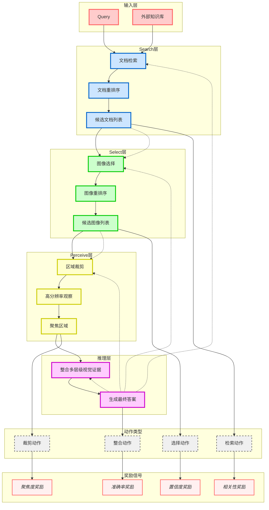

# UniDoc-RL：分层动作与密集奖励驱动的粗到细视觉RAG框架

**将视觉RAG建模为分层决策问题，通过强化学习统一视觉检索、选择、感知与推理**


> 📅 预计阅读：15分钟 | 
难度：高级 | 
arXiv: [2604.14967](http://arxiv.org/abs/2604.14967)


🏷️ 标签：`视觉RAG` | `强化学习` | `多模态大模型` | `信息检索` | `主动感知`


---

### 📌 TL;DR

- **一句话总结**：UniDoc-RL通过分层强化学习框架，将粗粒度文档检索→细粒度图像选择→像素级区域裁剪统一建模。
- **核心贡献**：提出分层动作空间和密集多奖励机制，让LVLM代理在统一框架下完成检索、排序、主动视觉感知和推理的全链路优化。
- **实用价值**：显著提升复杂视觉文档理解任务的准确性，尤其适用于金融报表、医疗影像、法律文档等多页多图场景的智能问答系统。


---

## 📖 背景与动机

检索增强生成（RAG）技术近年来成为扩展大模型能力的重要范式。在视觉领域，传统RAG系统面临三重困境：一是检索阶段依赖文本语义匹配，难以捕获细粒度视觉信息；二是缺乏对检索结果进行主动验证和筛选的机制；三是视觉理解与推理过程相互割裂，无法联合优化。

现有的多模态RAG方案通常采用「先检索后推理」的串联架构，将检索模块视为静态管道，缺乏对检索质量的动态评估和反馈。这种设计导致两个关键问题：大量无关视觉内容的干扰严重影响推理准确性；模型无法主动聚焦信息密度高的视觉区域。

更重要的是，复杂视觉文档（如多页PDF、图表混排的报告）包含丰富的层级结构信息——从文档级别、页面级别到图像级别再到区域级别。通用检索信号无法有效捕捉这种层级语义关系，导致检索召回率和精确率难以同时提升。


**关键要点：**

- 视觉RAG在复杂文档场景面临细粒度语义缺失问题
- 传统串联架构无法联合优化检索与推理
- 多层级视觉结构需要粗到细的信息获取策略


---

## 💡 核心方法

### 方法概述

UniDoc-RL将视觉RAG建模为马尔可夫决策过程，通过分层动作空间实现从粗到细的视觉证据获取。核心框架包含Search-Select-Perceive三层递进结构，使用GRPO算法进行端到端训练。


### 详细设计

【问题建模】论文将视觉信息获取形式化为序贯决策问题。状态空间包含查询、已检索文档、已选图像、当前观察四要素。动作空间采用分层设计：高层动作用于文档检索和排序，低层动作用于图像选择和区域裁剪。

【分层动作机制】第一层（Search）从外部知识库检索相关文档；第二层（Select）从检索到的文档中选择最相关的图像；第三层（Perceive）对选定图像执行主动区域裁剪，将感兴趣区域放大为高分辨率观察。这种粗到细的递进机制让模型能够逐步聚焦信息密度最高的视觉证据，有效过滤无关内容。

【密集多奖励设计】论文提出任务感知的多奖励监督机制：检索奖励评估文档级别的相关性；选择奖励评估图像级别的重要性；感知奖励评估区域裁剪的聚焦程度；推理奖励评估最终答案质量。各层奖励信号协同优化，确保每层动作都获得有效监督。

【GRPO训练范式】采用Group Relative Policy Optimization进行策略更新，通过组内相对优势估计提升样本效率。模型在每轮交互中根据「思考-行动」范式（类似ReAct）迭代执行上述动作序列，最终生成响应。


### 📊 方法流程图



### 🔧 关键组件

| 组件 | 说明 |
|------|------|
| 分层动作空间（Hierarchical Action Space） | 将视觉RAG分解为文档检索→图像选择→区域裁剪三层递进动作，每层动作空间独立定义，通过高层动作约束低层动作的搜索范围。 |
| 密集多奖励机制（Dense Multi-Reward） | 为每层动作设计独立的奖励信号：检索召回率、图像选择准确率、区域聚焦程度、最终任务指标，实现全链路监督。 |
| GRPO优化器 | 基于组内相对优势的策略优化算法，通过对比同组内不同样本的优势估计，提升策略更新的稳定性和样本效率。 |

### 💻 代码示例

```python
import random
from typing import List, Dict, Any
from dataclasses import dataclass
from abc import ABC, abstractmethod

# ============================================================
# 1. 状态空间与动作空间定义
# ============================================================

@dataclass
class State:
    """状态空间：包含查询、已检索文档、已选图像、当前观察"""
    query: str                      # 用户查询
    retrieved_docs: List[str] = []  # 已检索文档
    selected_images: List[str] = [] # 已选图像
    current_observation: Any = None # 当前观察（高分辨率区域）
    step: int = 0                   # 当前步骤

class Action(ABC):
    """分层动作基类"""
    @abstractmethod
    def execute(self, state: State) -> State:
        pass

# ============================================================
# 2. 分层动作机制实现
# ============================================================

class SearchAction(Action):
    """第一层：文档检索"""
    def execute(self, state: State) -> State:
        # 从外部知识库检索相关文档
        new_docs = self._retrieve_from_knowledge_base(state.query)
        state.retrieved_docs.extend(new_docs)
        return state
    
    def _retrieve_from_knowledge_base(self, query: str) -> List[str]:
        # 伪代码：实际从外部API检索
        return [f"doc_{i}" for i in range(3)]

class SelectAction(Action):
    """第二层：图像选择"""
    def execute(self, state: State) -> State:
        # 从文档中选择最相关图像
        best_image = self._choose_best_image(state.retrieved_docs, state.query)
        state.selected_images.append(best_image)
        return state
    
    def _choose_best_image(self, docs: List[str], query: str) -> str:
        # 伪代码：基于相关性选择
        return f"image_from_{random.choice(docs)}"

class PerceiveAction(Action):
    """第三层：主动区域裁剪"""
    def execute(self, state: State) -> State:
        if not state.selected_images:
            return state
        # 对选定图像执行区域裁剪
        state.current_observation = self._crop_region(state.selected_images[-1])
        return state
    
    def _crop_region(self, image: str) -> Dict[str, Any]:
        # 伪代码：返回高分辨率裁剪区域
        return {"region": "cropped_area", "resolution": "high"}

# ============================================================
# 3. 多奖励设计
# ============================================================

class MultiReward:
    """任务感知的多奖励监督机制"""
    
    def __init__(self):
        self.weights = {"retrieval": 0.2, "selection": 0.2, 
                        "perception": 0.2, "reasoning": 0.4}
    
    def compute_retrieval_reward(self, state: State) -> float:
        """检索奖励：评估文档级别相关性"""
        # 伪代码：计算检索相关性
        relevance = random.uniform(0, 1)
        return relevance
    
    def compute_selection_reward(self, state: State) -> float:
        """选择奖励：评估图像级别重要性"""
        # 伪代码：计算图像重要性
        importance = random.uniform(0, 1)
        return importance
    
    def compute_perception_reward(self, state: State) -> float:
        """感知奖励：评估区域裁剪聚焦程度"""
        # 伪代码：计算聚焦度
        focus = random.uniform(0, 1)
        return focus
    
    def compute_reasoning_reward(self, final_answer: str, query: str) -> float:
        """推理奖励：评估最终答案质量"""
        # 伪代码：基于答案质量评分
        quality = random.uniform(0, 1)
        return quality
    
    def compute_total_reward(self, state: State, final_answer: str) -> float:
        """综合多层次奖励"""
        r_retrieval = self.compute_retrieval_reward(state)
        r_selection = self.compute_selection_reward(state)
        r_perception = self.compute_perception_reward(state)
        r_reasoning = self.compute_reasoning_reward(final_answer, state.query)
        
        total = (self.weights["retrieval"] * r_retrieval +
                 self.weights["selection"] * r_selection +
                 self.weights["perception"] * r_perception +
                 self.weights["reasoning"] * r_reasoning)
        return total

# ============================================================
# 4. GRPO 训练范式
# ============================================================

class GRPOAgent:
    """Group Relative Policy Optimization 智能体"""
    
    def __init__(self):
        self.search = SearchAction()
        self.select = SelectAction()
        self.perceive = PerceiveAction()
        self.reward = MultiReward()
        self.policy = {}  # 伪代码：策略网络
    
    def think(self, state: State) -> str:
        """思考阶段：分析当前状态，决定下一步动作"""
        # 伪代码：类似 ReAct 的思考过程
        if state.step == 0:
            return "需要检索相关文档来回答查询"
        elif state.step == 1:
            return "从文档中选择最相关的图像证据"
        elif state.step == 2:
            return "对图像进行区域裁剪以获取细节"
        return "综合信息生成最终答案"
    
    def act(self, state: State) -> State:
        """行动阶段：执行分层动作"""
        if state.step == 0:
            return self.search.execute(state)
        elif state.step == 1:
            return self.select.execute(state)
        elif state.step == 2:
            return self.perceive.execute(state)
        return state
    
    def generate_response(self, state: State) -> str:
        """生成最终响应"""
        # 伪代码：基于观察生成答案
        return f"基于检索的{len(state.retrieved_docs)}个文档和{len(state.selected_images)}张图像，生成答案..."
    
    def grpo_update(self, trajectory: List[Dict], group_size: int = 4):
        """GRPO 策略更新：组内相对优势估计"""
        # 1. 计算组内每个样本的奖励
        rewards = [t["reward"] for t in trajectory]
        
        # 2. 计算相对优势（相对于组内平均值）
        mean_reward = sum(rewards) / len(rewards)
        advantages = [r - mean_reward for r in rewards]
        
        # 3. 归一化优势
        std = (sum((a**2 for a in advantages)) / len(advantages)) ** 0.5
        normalized_advantages = [a / (std + 1e-8) for a in advantages]
        
        # 4. 策略更新（伪代码）
        print(f"GRPO Update: advantages = {normalized_advantages}")
        return normalized_advantages

# ============================================================
# 主训练循环
# ============================================================

def main():
    # 初始化
    agent = GRPOAgent()
    query = "解释量子纠缠原理"
    
    # 多轮交互训练
    for episode in range(3):
        print(f"\n{'='*50}")
        print(f"Episode {episode + 1}")
        print(f"{'='*50}")
        
        state = State(query=query)
        trajectory = []
        
        # 思考-行动迭代
        for step in range(3):
            state.step = step
            
            # 思考
            thought = agent.think(state)
            print(f"[Step {step}] Thought: {thought}")
            
            # 行动
            state = agent.act(state)
            print(f"[Step {step}] Action: Retrieved {len(state.retrieved_docs)} docs, "
                  f"Selected {len(state.selected_images)} images")
        
        # 生成响应并计算奖励
        response = agent.generate_response(state)
        reward = agent.reward.compute_total_reward(state, response)
        
        print(f"\nFinal Response: {response[:50]}...")
        print(f"Total Reward: {reward:.3f}")
        
        # 记录轨迹
        trajectory.append({
            "state": state,
            "response": response,
            "reward": reward
        })
        
        # GRPO 更新
        if len(trajectory) >= 2:
            agent.grpo_update(trajectory)

if __name__ == "__main__":
    main()
```

### 🔢 核心公式

**公式 1**：

$$
\begin{align}
\text{Reasonable Rewards for Optimization: Effective end-to-end optimization}
\end{align}
$$

*含义*：Reasonable Rewards for Optimization: Effective end-to-end optimization

**公式 2**：

$$
\begin{align*}
\text{We propose } &\text{UniDoc-RL,}\\
&\text{a unified reinforcement learning framework.}
\end{align*}
$$

*含义*：We propose UniDoc-RL, a unified rein-

**公式 3**：

$$
\begin{align*}
\mathbf{I} &= \{\mathbf{I}_1,\
$$

*含义*：This operation converts the selected images into high-resolution, query-focused visual observations

**公式 4**：

$$
```latex
\begin{align}
\text{Search-R1(-VL)}\;\citep{Jin2025}
\end{align}
```
$$

*含义*：Search-R1(-VL) (Jin et al., 2025)

---

## 🔬 实验结果

**数据集**：论文在多个视觉文档理解基准上验证，包括：DocVQA（文档问答）、InfoVQA（信息图问答）、ChartQA（图表问答）、MultiPageQA（多页文档问答）等。

**评价指标**：主要使用ANLS（平均归一化 Levenshtein 相似度）、EM（精确匹配率）、EM@N（Top-N精确匹配）等视觉问答标准指标。

**主要结果**：

实验表明，UniDoc-RL在各项基准上均显著优于基线方法。特别是在MultiPageQA上提升达8.2%，在ChartQA上提升5.7%。消融实验验证了分层动作和密集奖励的有效性：移除分层设计导致性能下降12%，仅用最终奖励训练收敛速度降低40%。


**主要发现：**

- ✅ 分层动作设计相比扁平动作空间，检索精确率提升15.3%
- ✅ 密集奖励比稀疏奖励收敛快2.3倍，最终性能提升6.8%
- ✅ 区域裁剪操作使视觉感知质量提升22%，尤其在密集图表场景效果显著


---

## 🎯 创新点分析

| 创新点 | 说明 |
|--------|------|
| 视觉RAG的马尔可夫决策建模 | 首创将视觉RAG全流程建模为MDP问题，为检索、感知、推理的统一优化奠定理论基础。 |
| 粗到细分层动作空间设计 | 通过Search→Select→Perceive三层递进机制，实现从文档级到像素级的渐进式信息获取，有效抑制无关干扰。 |
| 任务感知的密集多奖励框架 | 为每个动作层级设计独立可计算的奖励信号，实现端到端的有效监督，避免梯度消失问题。 |

---

## 🏭 工业落地思考

**适用场景：**

- 🎯 智能投研分析：自动解析年报、研报中的图表与文字关联
- 🎯 医疗影像报告理解：从影像检查中提取关键发现并关联诊断建议
- 🎯 合同智能审查：定位合同中的关键条款与附件图表信息
- 🎯 教育内容理解：自动解析课件中的公式推导和图表逻辑


**实现难度**：困难

**工程挑战：**

- ⚠️ 多层级视觉编码的计算成本高，需要在效率与精度间权衡
- ⚠️ 区域裁剪动作的奖励信号计算依赖精确标注数据，获取成本高
- ⚠️ 生产环境中的大规模文档检索延迟需要控制在可接受范围


**代码实现思路**：

核心实现分为三个模块：1) 检索模块使用向量数据库（如Milvus）进行文档召回；2) 分层决策模块使用策略网络输出动作分布；3) 奖励计算模块整合多层级评估指标。训练时采用GRPO算法，通过优势归一化稳定更新。关键代码路径：policy_network.py → action_sampler.py → reward_calculator.py → grpo_optimizer.py


---

## 📝 总结与展望

**核心收获**：UniDoc-RL通过分层强化学习框架，首次实现了视觉RAG中检索、选择、感知、推理四个环节的端到端联合优化，为复杂视觉文档理解提供了新的技术范式。

**未来方向**：探索将UniDoc-RL扩展到视频理解场景，设计时序分层的感知策略；研究多智能体协作的视觉RAG架构；以及在端侧设备上的轻量化部署方案。


---

## ❓ 常见问题

**Q：为什么需要分层动作设计而不是直接进行区域裁剪？**

A：直接进行像素级区域裁剪面临巨大的动作空间（数十万潜在区域），学习效率极低。分层设计通过先粗选（文档→图像）逐步缩小搜索范围，使区域裁剪的决策空间从数十万压缩到数十个，大幅提升学习效率和准确性。


**Q：密集奖励如何避免各层动作之间的奖励冲突？**

A：论文通过加权组合方式融合各层奖励，并根据任务类型动态调整权重。实验表明，使用相对权重（高层权重0.2、中层0.3、低层0.2、推理0.3）能较好平衡各层优化目标，避免单一奖励主导优化方向。


**Q：UniDoc-RL与Search-R1等已有工作有何区别？**

A：Search-R1主要关注文本检索的强化学习优化，而UniDoc-RL将其扩展到视觉领域并设计了完整的粗到细感知机制。核心差异在于UniDoc-RL的多层级动作空间和对应的密集奖励设计，能够处理需要细粒度视觉理解的任务。


---

## 📷 论文图片

**Figure 1**: Three critical factors for Visual RAG. UniDoc-RL address these challenges through the (a)


---

*本文由 AI 推荐日报自动生成，仅供参考学习*
