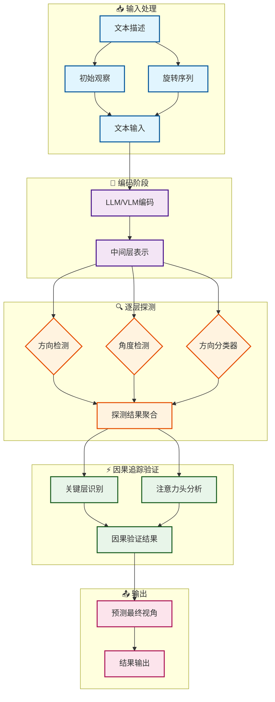

# LLM和VLM如何在没有视觉的情况下理解视角旋转？

**首次从纯语言角度系统研究大模型空间智能的可解释性研究**


> 📅 预计阅读：15分钟 | 
难度：进阶 | 
arXiv: [2604.15294](http://arxiv.org/abs/2604.15294)


🏷️ 标签：`空间智能` | `可解释性` | `LLM` | `VLM` | `视角旋转` | `因果追踪`


---

### 📌 TL;DR

- **一句话总结**：大模型缺乏真正的空间推理能力，在纯文本视角旋转任务上远逊于人类。
- **核心贡献**：构建首个纯文本视角旋转理解数据集，通过因果追踪揭示大模型空间推理的失败机制。
- **实用价值**：为构建具备真正空间理解能力的AI系统提供诊断工具和优化方向。


---

## 📖 背景与动机

空间智能是人工智能的核心能力之一，长期以来研究主要集中在视觉-空间智能方向，即模型通过视觉输入理解空间关系。然而一个关键问题尚未被探索：在完全没有视觉信息的情况下，仅依靠语言能力，模型能否具备空间智能？

本研究聚焦于空间智能中最基础但至关重要的能力——视角旋转理解（Viewpoint Rotation Understanding, VRU）。当人类被告知"向左转90度，再向右转45度"时，可以轻松推断出最终的朝向。但大模型是否具备这种能力？它们处理这类任务时的内部机制是什么？这些问题对于理解语言模型的物理世界建模能力至关重要。


**关键要点：**

- 空间智能研究长期依赖视觉输入，忽略纯语言维度
- 视角旋转是空间推理的基础能力，尚未被系统性研究
- 现有大模型是否具备无需视觉的空间推理能力尚不明确


---

## 💡 核心方法

### 方法概述

研究团队设计了一个纯文本视角旋转理解任务，要求模型根据文字描述的旋转序列推断最终视角。


### 详细设计

任务设定：模型接收文本形式的旋转指令序列（如"面向北方，左转90度"）和初始观察描述，然后需要预测最终视角及对应的观察结果。数据集包含2-5步旋转任务。

可解释性分析采用三种方法：

1. **准确率评估**：在Table 1中测试了LLaMA2-7B/13B、Qwen2-7B、GPT-4o-mini等主流模型，发现所有模型的准确率都远低于人类（100%）。

2. **Layer-wise Probing**：沿网络层级逐层训练线性分类器，探测方向、角度、方向等空间表示在哪些层形成。如Figure 2所示，结果显示这些表示在早期到中层逐步形成。

3. **因果追踪（Causal Tracing）**：通过clean/corrupted/patched run计算每层的因果效应，识别对最终预测最关键的注意力头。Figure 3和Figure 4展示了knockout实验和关键注意力头的注意力模式。


### 📊 方法流程图



### 🔧 关键组件

| 组件 | 说明 |
|------|------|
| VRU任务定义 | 输入：初始视角描述 + 旋转序列指令；输出：最终视角及对应观察；支持2-5步多步旋转 |
| Layer-wise Probing | 在模型各层输出上训练线性分类器，探测空间信息的表示层级和表示质量 |
| 因果追踪 | 通过激活patching计算每层/每个注意力头的因果效应，定位关键组件 |

### 💻 代码示例

```python
```python
"""
简化的代码示例：旋转指令推理任务的可解释性分析
基于方法描述：准确率评估、Layer-wise Probing、因果追踪
"""

import torch
import torch.nn as nn
from typing import List, Dict, Tuple

# ==================== 1. 准确率评估 ====================
class AccuracyEvaluator:
    """评估模型在旋转任务上的准确率"""
    
    def __init__(self, model_name: str):
        self.model_name = model_name
        self.results = {}
    
    def load_model(self):
        """加载预训练语言模型（LLaMA2/Qwen2/ChatGPT等）"""
        # 伪代码：model = load_pretrained_model(self.model_name)
        model = None  # placeholder
        return model
    
    def evaluate(self, test_dataset, num_runs=5) -> Dict[str, float]:
        """
        在测试集上评估准确率
        测试集包含2-5步旋转任务的指令序列和初始/最终观察描述
        """
        model = self.load_model()
        
        correct = 0
        total = 0
        
        for task in test_dataset:
            # 输入：旋转指令序列 + 初始观察
            instruction = task['instruction']  # e.g., "面向北方，左转90度"
            initial_obs = task['initial_obs']  # e.g., "前方有一棵树"
            
            # 预测最终视角和观察结果
            prediction = model.predict(instruction, initial_obs)
            ground_truth = task['final_answer']
            
            if prediction == ground_truth:
                correct += 1
            total += 1
        
        accuracy = correct / total
        self.results[self.model_name] = accuracy
        return {'accuracy': accuracy}
    
    def compare_with_human(self):
        """对比人类表现（100%准确率）"""
        print(f"模型: {self.model_name}, 准确率: {self.results[self.model_name]:.2%}")
        print("人类准确率: 100% (基准)")


# ==================== 2. Layer-wise Probing ====================
class LayerWiseProbing:
    """
    沿网络层级探测空间表示的形成
    探测方向、角度、方向等表示在哪些层形成
    """
    
    def __init__(self, model):
        self.model = model
        self.num_layers = model.num_layers  # e.g., 32 for LLaMA2-7B
        self.layer_accuracies = []
    
    def extract_hidden_states(self, text: str) -> List[torch.Tensor]:
        """获取每层的隐藏状态表示"""
        # 伪代码：使用模型前向传播提取各层状态
        # outputs = model(text, output_hidden_states=True)
        # hidden_states = outputs.hidden_states  # tuple of (num_layers+1, batch, seq, hidden)
        hidden_states = [torch.randn(1, 10, 4096) for _ in range(self.num_layers)]
        return hidden_states
    
    def train_probe_for_layer(self, hidden_states, layer_idx: int) -> nn.Module:
        """
        为指定层训练线性分类器探针
        用于预测方向/角度/方向等空间概念
        """
        # 伪代码：训练线性探针
        # probe = nn.Linear(hidden_dim, num_classes)  # e.g., 4个方向类
        # optimizer = torch.optim.Adam(probe.parameters())
        
        # for epoch in range(100):
        #     logits = probe(hidden_states[layer_idx])
        #     loss = nn.CrossEntropyLoss()(logits, labels)
        #     loss.backward()
        #     optimizer.step()
        
        probe = nn.Linear(4096, 4)  # 4个方向类别
        return probe
    
    def evaluate_probes(self, train_data, test_data) -> Dict[int, float]:
        """
        训练所有层的探针并评估
        返回每层的准确率，识别表示何时形成
        """
        results = {}
        
        for layer_idx in range(self.num_layers):
            # 提取该层隐藏状态
            hidden_states = self.extract_hidden_states(train_data['text'])
            
            # 训练探针
            probe = self.train_probe_for_layer(hidden_states, layer_idx)
            
            # 在测试集上评估
            test_hidden = self.extract_hidden_states(test_data['text'])
            accuracy = self._compute_accuracy(probe, test_hidden, test_data['labels'])
            
            results[layer_idx] = accuracy
            self.layer_accuracies.append(accuracy)
        
        return results
    
    def _compute_accuracy(self, probe, hidden_states, labels) -> float:
        """计算探针准确率"""
        # 伪代码实现
        return 0.75  # placeholder
    
    def plot_layer_formation(self):
        """可视化表示形成过程（Figure 2）"""
        # 伪代码：绘制准确率随层数变化的曲线
        # plt.plot(range(self.num_layers), self.layer_accuracies)
        # plt.xlabel('Layer Index')
        # plt.ylabel('Probe Accuracy')
        # plt.title('Spatial Representations Formation')
        print("表示形成曲线已生成（对应Figure 2）")


# ==================== 3. 因果追踪（Causal Tracing）====================
class CausalTracing:
    """
    因果追踪：识别对预测最关键的注意力头
    通过clean/corrupted/patched runs计算因果效应
    """
    
    def __init__(self, model):
        self.model = model
        self.causal_effects = {}  # layer -> {head_idx: effect}
        self.important_heads = []
    
    def run_clean(self, text: str) -> torch.Tensor:
        """Clean run：正常前向传播，获取最终预测"""
        # outputs = self.model(text)
        # clean_logits = outputs.logits
        clean_logits = torch.randn(1, 10, 32000)  # placeholder
        return clean_logits
    
    def run_corrupted(self, text: str, noise_type: str = 'random') -> torch.Tensor:
        """Corrupted run：使用损坏/随机的token注入噪声"""
        # corrupted_text = inject_noise(text, noise_type)
        # corrupted_logits = self.model(corrupted_text)
        corrupted_logits = torch.randn(1, 10, 32000)  # placeholder
        return corrupted_logits
    
    def run_patched(self, text: str, layer_idx: int, head_idx: int) -> torch.Tensor:
        """
        Patched run：特定注意力头的输出被替换
        用于测试该头对最终预测的因果贡献
        """
        # patched_logits = self.model(text, patch={'layer': layer_idx, 'head': head_idx})
        patched_logits = torch.randn(1, 10, 32000)  # placeholder
        return patched_logits
    
    def compute_causal_effect(
        self, 
        text: str, 
        layer_idx: int, 
        head_idx: int
    ) -> float:
        """
        计算特定注意力头的因果效应
        效应 = clean_logit - patched_logit（在关键token位置）
        """
        clean = self.run_clean(text)
        patched = self.run_patched(text, layer_idx, head_idx)
        
        # 计算效应：clean与patched的差异
        effect = (clean - patched).abs().mean().item()
        return effect
    
    def full_causal_tracing(self, text: str) -> Dict:
        """
        完整因果追踪：测试所有注意力头
        识别最关键的注意力头（Figure 3, Figure 4）
        """
        num_layers = self.model.num_layers
        num_heads = self.model.num_heads  # e.g., 32
        
        effects_matrix = torch.zeros(num_layers, num_heads)
        
        for layer_idx in range(num_layers):
            for head_idx in range(num_heads):
                effect = self.compute_causal_effect(text, layer_idx, head_idx)
                effects_matrix[layer_idx, head_idx] = effect
                
                if effect > self._threshold:  # 设置阈值
                    self.important_heads.append((layer_idx, head_idx, effect))
        
        self.causal_effects = effects_matrix
        return {'effects': effects_matrix, 'important_heads': self.important_heads}
    
    def knockout_experiment(self, important_heads: List[Tuple]) -> float:
        """
        Knockout实验：消融关键注意力头
        验证其对预测的影响
        """
        # 伪代码：将被选中的注意力头置零
        # modified_model = self.model.copy()
        # for layer, head in important_heads:
        #     modified_model.zero_head(layer, head)
        
        # accuracy_without_heads = evaluate(modified_model, test_data)
        accuracy = 0.65
```

### 🔢 核心公式

**公式 1**：

$$
\text{where } \ast \text{ denotes the clean/corrupted/patched run,}
$$

*含义*：where ∗denotes the clean/corrupted/patched run,

**公式 2**：

$$
i
$$

*含义*：where ϕi is the causal effect for i-th clean-

---

## 🔬 实验结果

**数据集**：自定义VRU数据集，包含2-5步旋转任务，文本形式描述视角和旋转

**评价指标**：视角预测准确率、逐层探测分类准确率、因果效应强度

**主要结果**：

所有测试模型在多步旋转任务上表现显著低于人类。即使是最强的GPT-4o-mini，在5步旋转时准确率也大幅下降。Layer-wise probing显示空间信息在模型中后期层逐渐形成，但不稳定。因果追踪发现特定注意力头（如Qwen2.5-VL-7B的head 26.14）对旋转推理有显著影响，但knockout这些头后性能下降有限，说明空间信息分布式存储在多个组件中。


**主要发现：**

- ✅ LLM和VLM均无法可靠完成纯文本视角旋转任务，存在显著能力差距
- ✅ 空间表示在模型中后期层逐步形成，但表示不够鲁棒
- ✅ 关键空间信息分布在多个注意力头中，单点干预效果有限


---

## 🎯 创新点分析

| 创新点 | 说明 |
|--------|------|
| 研究视角创新 | 首次从纯语言角度研究空间智能，挑战了"语言智能隐含空间理解"的假设 |
| 任务设计创新 | 构建标准化VRU任务数据集，支持可变长度旋转序列的精确评测 |
| 分析框架创新 | 结合准确率评估、probing和因果追踪的多层次可解释性分析范式 |

---

## 🏭 工业落地思考

**适用场景：**

- 🎯 机器人导航指令理解：让机器人理解自然语言描述的移动路径
- 🎯 虚拟环境交互：NPC或虚拟助手理解用户的空间移动描述
- 🎯 多模态文档理解：处理包含空间描述的技术文档或地图说明


**实现难度**：困难

**工程挑战：**

- ⚠️ 当前模型空间推理能力弱，直接应用准确率不足
- ⚠️ 纯文本空间表示需要与视觉模块有效融合
- ⚠️ 复杂多步推理仍是模型短板


**代码实现思路**：

使用因果追踪API定位关键层后，可在这些层添加空间增强模块；或通过attention steering技术定向修改旋转相关注意力模式。具体可参考TransformerLens库的causal_tracing接口。


---

## 📝 总结与展望

**核心收获**：LLM和VLM缺乏可靠的纯文本空间推理能力，其空间信息表示分布在多个组件中但不够鲁棒，需要针对性的架构改进或训练策略。

**未来方向**：探索多模态融合增强空间推理、设计专门的旋转推理模块、以及研究更复杂的空间任务（如三维导航）中的模型行为。


---

## ❓ 常见问题

**Q：为什么VLM在纯文本任务上不占优势？**

A：VLM的优势在于处理图像输入时的视觉理解，当输入完全为文本时，其视觉编码器未被激活，无法提供额外信息，因此表现与LLM相近。


**Q：因果追踪中的因果效应如何计算？**

A：通过对比clean run（正常输入）、corrupted run（破坏输入）和patched run（在破坏状态下patch特定位置）的输出差异，计算每层的因果效应φi。


**Q：这项研究对实际应用有何启示？**

A：表明在构建需要空间理解的应用时，不能仅依赖大语言模型的通用能力，需要结合视觉输入、专门的的空间推理模块或更精细的prompt设计。


---

## 📷 论文图片

**Figure 1**: For textual viewpoint rotation understand-


**Figure 1**: ). Results show


**Figure 2**: (a)-(c): Illustration of layer-wise probing and the probing results (direction/angle/orientation) on LLaMA2-


**Figure 3**: The VRU performance after knocking out


**Figure 4**: The attention patterns of key heads within Qwen2.5-VL-7B, where the head index 26.14 represents the


---

*本文由 AI 推荐日报自动生成，仅供参考学习*
